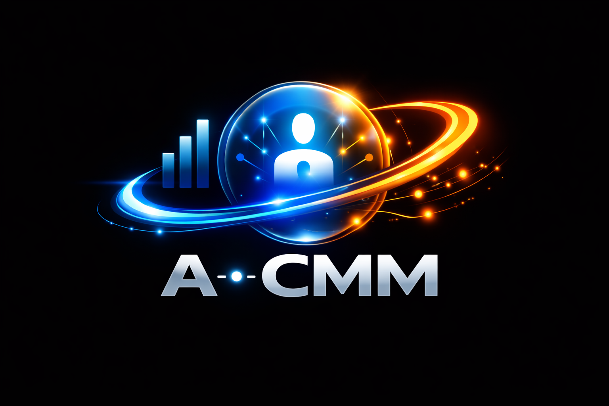

<p align="center">
  
</p>

<h1 align="center">AiCMM — Agent Capability Maturity Model</h1>

<p align="center">
  <strong>A unified, multi-dimensional framework for classifying AI agent capabilities</strong>
</p>

<p align="center">
  <a href="LICENSE"></a>
  <a href="https://openjdk.org/"></a>
  <a href="CONTRIBUTING.md"></a>
  <a href="https://github.com/snchande/Arima-AiCMM/actions"></a>
</p>

---

## Overview

**AiCMM (Agent Capability Maturity Model)** is an open-source framework that helps developers, architects, and organizations **classify, evaluate, and communicate** the capabilities of AI agents in a structured, comparable way.

Instead of treating all AI agents as equal — or relying on vague marketing terms — AiCMM provides a **12-dimension, two-level scoring architecture** (each scored 0–5) that produces a unique **capability fingerprint** for any agent, whether it's a simple chatbot, an autonomous coding assistant, or an embodied robot.

The result is an **Agent Card**: a standardized, machine-readable description of what an agent can and cannot do — enabling informed decisions about deployment, governance, and interoperability.

### Level 0 — 12 Universal Dimensions

| Group | Pos | Key | Name | What It Measures |
|-------|-----|-----|------|------------------|
| **Cognitive Core** | 0 | `autonomy` | **Autonomy** | Self-directed action without human intervention |
| **Cognitive Core** | 1 | `reasoning` | **Reasoning & Planning** | Structured problem-solving under uncertainty |
| **Cognitive Core** | 2 | `memory` | **Memory & Context** | Information retention, retrieval, temporal awareness |
| **Cognitive Core** | 3 | `learning` | **Learning & Adaptation** | Ability to improve from experience safely |
| **Action & Integration** | 4 | `toolUse` | **Tool Use & Integration** | Orchestrating external tools and APIs |
| **Action & Integration** | 5 | `collaboration` | **Collaboration & Social Intelligence** | Coordination with humans/agents, empathy, age-appropriate communication |
| **Action & Integration** | 6 | `embodiment` | **Embodiment** | Physical/virtual presence — perception, navigation, manipulation |
| **Trust & Deployment** | 7 | `explainability` | **Explainability & Transparency** | Ability to justify decisions, expose reasoning traces, and support review |
| **Trust & Deployment** | 8 | `safety` | **Safety & Containment** | Controls that prevent harmful or unsafe actions |
| **Trust & Deployment** | 9 | `interoperability` | **Interoperability** | Ability to work across protocols, ecosystems, and agents |
| **Trust & Deployment** | 10 | `costEfficiency` | **Cost Efficiency** | Resource awareness, bounded execution, and economic viability |
| **Trust & Deployment** | 11 | `domainAlignment` | **Domain Alignment** | Domain-specific policy, compliance, and deployment fit |

These 12 Level 0 dimensions are organized into three groups: **Cognitive Core**, **Action & Integration**, and **Trust & Deployment**.

### Position 12 — Agency Qualification Layer (Derived)

After the 12 core dimensions, AiCMM appends a **derived 13th dimension** — the **Agency
Qualification Layer**. It is *never authored by hand*: it is computed from the twelve scores
(plus the 7 governance rules) to answer *"Is this a genuine agent, and how agentic is it?"*
This stops trivial automations from being mislabeled as "agents" while still recognizing
truly autonomous systems. Positions 0–11 stay fixed; the agency layer simply *follows*
position 11, so radar charts stay comparable.

A system qualifies as an **agent** (level ≥ 0) only when **Autonomy ≥ 2 and Reasoning ≥ 2**.
Below that it lands on the negative "non-agent" ladder.

| Level | Code | Label | Agent? |
|------:|------|-------|:------:|
| **−2** | `SCRIPTED_AUTOMATION` | Non-Agent — Scripted Automation (RPA/ETL) | No |
| **−1** | `REACTIVE_ASSISTANT` | Non-Agent — Reactive Assistant (FAQ bot, early Siri/Alexa) | No |
| **0** | `PROTO_AGENT` | Proto-Agent — Emerging Agency (e.g. AutoGPT) | Yes |
| **1** | `BASIC_AGENT` | Basic Agent — Qualified | Yes |
| **2** | `ADVANCED_AGENT` | Advanced Agent — Autonomous & Trust-Aligned (Copilot CLI, Tesla FSD) | Yes |
| **3** | `GENERALIZED_AGENT` | Generalized Agent — Cutting-Edge | Yes |
| **4** | `HUMAN_LEVEL_AGENT` | Human-Level Agent (human-level general intelligence) | Yes |
| **5** | `HUMANOID_AGENT` | Humanoid Agent — Indistinguishable from Human (synthetic skin, touch, taste) | Yes |

The layer is implemented in `org.aicmm.scoring.AgencyClassifier`, exposed by the site API
(`GET /api/agency-levels`), and surfaced as the MCP tool `aicmm_get_agency_levels`. Each card
also carries a derived **Agency Index (0–100)** — a weighted "barometer" reading rendered as a
horizontal ladder strip whose needle shows momentum toward the next level. See
[`docs/specifications/dimension-ordering.md`](docs/specifications/dimension-ordering.md) for
the full classification algorithm and index weights.

### Three Generations of Agent Evolution

AiCMM provides a common capability lens across the three eras of agent evolution:
**Gen 1 — Classical/Expert Systems** (1990s: rules, reactive, deterministic),
**Gen 2 — Distributed/Learning Systems** (2000s–2010s: neural nets, adaptive, enterprise
integration, early Siri/Alexa), and **Gen 3 — Modern Agentic GenAI** (2020s: transformers,
reasoning, tool use, collaboration). The Agency Qualification Layer sits on top to classify
any system from any era on a single ladder.

### Level 1 — Domain Deep-Dive

Level 1 adds **domain-specific radar charts** for sectors such as Healthcare, Transportation, Finance, and Manufacturing. These domain profiles are **drill-downs**, not replacements for Level 0, and let teams score specialized requirements alongside the universal 12-dimension baseline.

---

## Why AiCMM?

Today's AI agent ecosystem is exploding — but we lack a common language to describe what agents actually do. This creates real problems:

| Problem | How AiCMM Helps |
|---------|----------------|
| **"All agents are the same"** | Multi-dimensional scoring reveals that a coding agent and a robot are fundamentally different systems |
| **No way to compare agents** | Capability fingerprints enable apples-to-apples comparison across vendors |
| **Governance is an afterthought** | Trust & Deployment dimensions and 7 governance rules make deployment constraints explicit |
| **Vendor marketing is opaque** | Agent Cards provide evidence-based, verifiable capability claims |
| **Standards lack capability metadata** | AiCMM integrates with A2A, MCP, and other protocols via embeddable classifications |

### Key Design Principles

- **Multi-dimensional, not linear** — No single "maturity level"; agents have unique profiles
- **Evidence-based scoring** — Each level requires observable, testable indicators
- **Governance built-in** — High autonomy is gated by reasoning, explainability, safety, cost, interoperability, and domain-fit checks
- **Protocol-agnostic** — Embeds into any agent communication standard
- **Community-driven** — Open for co-authoring, industry adaptations, and new dimensions

---

## Repo Structure

```
AiCMM/
├── docs/                              # Documentation
│   ├── articles/                      # Original articles (LinkedIn + Medium)
│   │   ├── introduction-linkedin.md   # "Not All AI Agents Are the Same"
│   │   ├── overview-medium.md         # Full framework specification
│   │   ├── introduction-linkedin.pdf  # PDF versions
│   │   └── overview-medium.pdf
│   └── diagrams/                      # Mermaid architecture diagrams
│
├── aicmm-core/                        # Core library
│   └── src/main/java/org/aicmm/
│       ├── model/                     # Dimension, DimensionScore, CapabilityProfile
│       ├── scoring/                   # ScoringEngine — validation & analysis
│       └── agentcard/                 # AgentCard record + JSON serializer
│
├── aicmm-inspector/                   # Agent inspection framework
│   └── src/main/java/org/aicmm/inspector/
│       └── AgentInspector.java        # Interface for agent investigation
│
├── aicmm-cli/                         # Command-line interface (Picocli)
│   └── src/main/java/org/aicmm/cli/
│       └── AicmmCli.java              # CLI entry point
│
├── aicmm-site/                        # Documentation web server (Javalin)
│   └── src/main/java/org/aicmm/site/ # Renders docs, agent cards, diagrams
│
├── schemas/
│   └── agent-card.schema.json         # JSON Schema for Agent Cards
│
├── tools/
│   └── interaction-agent/             # AiCMM Interact — local human-in-the-loop UI
│       ├── server.js                  # Zero-dependency picker server (node server.js)
│       ├── prompt.json                # Question spec (choices/images/text)
│       └── README.md                  # Schema + usage
│
├── examples/
│   ├── copilot-cli-agent-card.json            # Example: GitHub Copilot CLI scored
│   ├── medassist-pro-agent-card.json          # Example: Healthcare hybrid (Level 0 + Level 1)
│   ├── autonav-fleet-agent-card.json          # Example: Transportation embodied (Level 0 + Level 1)
│   ├── finguard-analyst-agent-card.json       # Example: Finance digital (Level 0 + Level 1)
│   └── smartfactory-orchestrator-agent-card.json # Example: Manufacturing hybrid (Level 0 + Level 1)
│
├── pom.xml                            # Maven parent POM (Java 17)
├── LICENSE                            # MIT License
├── CONTRIBUTING.md                    # How to contribute
└── CHANGELOG.md                       # Release history
```

---

## How to Use

### Quick Start (seamless)

```bash
git clone https://github.com/snchande/Arima-AiCMM.git
cd Arima-AiCMM
copilot            # @aicmm + skills auto-install, the site builds & starts on :8080
```

First `copilot` launch installs the agents/skills, checks for Java, builds the jar, and opens http://localhost:8080. Then type `@aicmm` in Copilot.

### Prerequisites

- **Java 17+** — required to run the site/CLI. If missing, startup auto-installs via `winget` on Windows; else install manually:
  - Windows: `winget install Microsoft.OpenJDK.21` · macOS: `brew install openjdk@21` · Linux: `sudo apt install openjdk-21-jdk` · or <https://learn.microsoft.com/java/openjdk/download>
- **Maven 3.8+** — only to build from source. **Git** — to clone.
- **An agentic CLI (optional)** — for `@aicmm`. Don't have one? See below.

### No Copilot/LLM CLI? You can still use AiCMM

`@aicmm` needs an agentic CLI, but the framework works without one:

- **GitHub Copilot CLI** (recommended): `npm install -g @github/copilot` then run `copilot` — auto-starts everything. (Others: Claude Code → `CLAUDE.md`, Gemini CLI → `GEMINI.md`.)
- **No CLI at all** — use the **web UI + REST API**: `mvn clean install` then `java -jar aicmm-site/target/aicmm-site-0.1.0-SNAPSHOT.jar` → http://localhost:8080 (Create Card form, Catalog, validate/score via `/api/*`).
- **Programmatic** — add `aicmm-core` to your build and create cards in Java (see *Use as a Library*).

### Build the Project

```bash
git clone https://github.com/snchande/Arima-AiCMM.git
cd Arima-AiCMM
mvn clean install
```

### Run the Documentation Site

```bash
java -jar aicmm-site/target/aicmm-site-0.1.0-SNAPSHOT.jar
# → Open http://localhost:8080
```

The site renders all docs with Mermaid diagrams, an interactive **Catalog** with radar charts and Agency barometers, a live **Create Card** form, and the **Brochure**, **Guide**, **Framework**, **Architecture**, and **Schema** pages. If you open this repo with the Copilot CLI, the site auto-starts (see *Auto-start* below).

### Rate Your Agent with Any Copilot / LLM CLI

You don't need to score by hand. Clone the repo, point your favorite agentic CLI (GitHub Copilot CLI, Claude Code, Gemini CLI) at it, feed your agent's docs — a **product brochure**, README, or API page — and ask it to build a card. The repo ships in-repo agents and skills plus an MCP server, so the CLI does the scoring, governance check, radar, fingerprint, and Agency scaling for you:

```text
> Create an AiCMM Agent Card for our product. Brochure: ./mybot-brochure.pdf
```

Sample prompts (work in Copilot CLI, Claude Code, Gemini CLI):

```text
# Brochure / docs → Agent Card
> @aicmm Create an AiCMM Agent Card from ./mybot-brochure.pdf and save to examples/
> @aicmm Build a card for the agent at https://acme.ai/product

# Agent Footprint: radar fingerprint + Agency level/index
> @aicmm Score examples/mybot-agent-card.json and show the radar fingerprint
> @aicmm What Agency level and Index does mybot reach, and which dimensions cap it?
> @aicmm Validate governance and list any failing rules
```

Behind the scenes the CLI uses: the **`aicmm`** agent + **create-agent-card / score-agent / validate-governance** skills (`.copilot/`), and the **aicmm** MCP server (`.mcp.json`). It writes `examples/<name>-agent-card.json`, then the site renders the **radar fingerprint** and **Agency footprint**. See [`docs/guides/user-guide.md`](docs/guides/user-guide.md). MCP/skills also work in Claude Code (`CLAUDE.md`) and Gemini CLI (`GEMINI.md`).

### Use as a Library (Programmatic Agent Cards)

Add the core module to your project:

```xml
<dependency>
  <groupId>org.aicmm</groupId>
  <artifactId>aicmm-core</artifactId>
  <version>0.1.0-SNAPSHOT</version>
</dependency>
```

```java
import org.aicmm.model.*;
import org.aicmm.scoring.ScoringEngine;
import org.aicmm.agentcard.AgentCard;

// Build a Level 0 capability profile
CapabilityProfile profile = CapabilityProfile.builder()
    .score(Dimension.AUTONOMY, 4)
    .score(Dimension.REASONING_AND_PLANNING, 4)
    .score(Dimension.MEMORY_AND_CONTEXT, 4)
    .score(Dimension.LEARNING_AND_ADAPTATION, 3)
    .score(Dimension.TOOL_USE_AND_INTEGRATION, 5)
    .score(Dimension.COLLABORATION_AND_SOCIAL_ABILITY, 3)
    .score(Dimension.EMBODIMENT, 0)
    .score(Dimension.EXPLAINABILITY_AND_TRANSPARENCY, 4)
    .score(Dimension.SAFETY_AND_CONTAINMENT, 3)
    .score(Dimension.INTEROPERABILITY, 4)
    .score(Dimension.COST_EFFICIENCY, 2)
    .score(Dimension.DOMAIN_ALIGNMENT, 4)
    .build();

// Validate governance rules
ScoringEngine engine = new ScoringEngine();
List<String> warnings = engine.validate(profile);

// Create an Agent Card
AgentCard card = new AgentCard("My Agent", "1.0", profile, AgentCategory.DIGITAL);
```

---

## AiCMM Interact (Human-in-the-Loop UI)

`tools/interaction-agent/` is a zero-dependency local server that lets the CLI/agent ask you visual questions in the browser and read your answer back. Clone and run — no install:

```bash
cd tools/interaction-agent
node server.js          # opens http://localhost:8099
```

Edit `prompt.json` to define the question (`single` image cards, `multi`-select, or `text`). On Submit it writes `response.json` (`{choice}` / `{choices}` / `{text}`) and exits. Use via the **aicmm-interact** agent and **collect-user-choice** skill. See `tools/interaction-agent/README.md`.

### Auto-start on Copilot CLI launch
A `sessionStart` hook (`.github/hooks/aicmm-startup.json`) runs `scripts/start-aicmm.ps1`, which (1) installs the repo's agents & skills into `~/.copilot` via `scripts/setup-agents.ps1` so **`@aicmm`** is immediately discoverable, and (2) starts the AiCMM site on http://localhost:8080 (only if not already running) and opens it. Clone the repo and just run `copilot` — `@aicmm` is ready and the site comes up automatically. To set up agents without launching the CLI, run `scripts/setup-agents.ps1` manually.

### FAA — Floating Agentic Assistance
Every site page carries a floating AiCMM assistant button (bottom-right). Click it for a slide-in, **page-aware** helper:
- **Agentic when a CLI is present** — bridges to a local LLM CLI (GitHub Copilot today; Claude Code / Gemini if installed) for live, tool-using answers.
- **Offline fallback** — with no CLI, a built-in knowledge base still answers about dimensions, governance, the Agency ladder, and creating/scoring cards.
- **Two modes** — **Assist** answers questions about the page; **Develop & Extend** runs the CLI in the repo root so it can edit code/docs, rebuild, restart, and open PRs — turning the site into a contribution hub for developers and non-developers (code, docs, or agent ratings).
- **Integrity gate** — before opening any PR, contribute mode runs `scripts/run-foundational-tests.ps1`, which locks the 7 governance rules, the agent threshold, the Agency ladder (−2..+5), and the 12-dimension structure. A PR is only proposed when the gate passes, and the test summary is pasted into the PR description so nothing foundational breaks.
- **Pin & auto-tuck (📌)** — the panel quietly tucks away when you click outside it, unless you pin it open.
- **Settings (⚙)** — pick the default CLI/provider, switch models, and set temperature (where the CLI supports it). Preferences persist to `~/.aicmm/faa-settings.json`.

Endpoints: `POST /api/assist` (accepts `mode` + `history`), `GET /api/assist/providers`, `GET`/`POST /api/assist/settings`. Adding a new CLI is a one-line `CliSpec` — a call for contributions.

### One-command restart (secret takeover)
Restart the site cleanly even after code/static changes:

```bash
scripts/restart-aicmm.ps1            # secret-shutdown old server → rebuild jar → start
scripts/restart-aicmm.ps1 -NoBuild   # skip the rebuild, just restart
```

The script sends a secret code (`X-AiCMM-Token`, default `aicmm-secret-restart`, override via `AICMM_ADMIN_TOKEN`) to `POST /api/admin/shutdown` so the running instance exits and releases the jar lock; it then rebuilds and relaunches. On boot the server also runs a `takeOverPort()` guard against any straggler still holding the port.


## How to Classify an Agent

Classification follows a structured process:

### Step 1: Identify the Agent Category

| Category | Description | Examples |
|----------|-------------|----------|
| **Digital** | Software-only, no physical interaction | Copilot, ChatGPT, AutoGPT |
| **Embodied** | Has physical presence or sensors | Spot, surgical robots, drones |
| **Hybrid** | Combines digital reasoning with physical action | Tesla FSD, warehouse robots |

### Step 2: Score Each Dimension (0–5)

For each of the 12 Level 0 dimensions, assign a level based on observable evidence:

| Level | Meaning | Indicator |
|-------|---------|-----------|
| **0** | None | Capability absent |
| **1** | Basic | Minimal, hardcoded behavior |
| **2** | Intermediate | Structured but limited scope |
| **3** | Advanced | Handles complexity with guardrails |
| **4** | Expert | Autonomous within defined boundaries |
| **5** | Mastery | Full autonomy with self-governance |

### Step 3: Apply Governance Rules

1. **Autonomy-Reasoning Foundation** — `Autonomy >= 4` requires `Reasoning >= 4`
2. **Explainability Gate** — `Autonomy >= 4` requires `Explainability >= 3`
3. **Safety Gate** — `Embodiment >= 3` requires `Safety >= 4`
4. **Collaboration-Interop Link** — `Collaboration >= 4` requires `Interoperability >= 3`
5. **Cost Awareness** — `Autonomy >= 4` requires `CostEfficiency >= 2`
6. **Domain Alignment** — `Autonomy >= 4` requires `DomainAlignment >= 3`
7. **Reasoning Foundation** — `Autonomy >= 4` requires `Reasoning >= 3`

### Step 4: Generate the Capability Fingerprint

The 12 scores form a Level 0 fingerprint: `[4, 4, 4, 3, 5, 3, 0, 4, 3, 4, 2, 4]`

This can be visualized as a radar chart, compared across agents, and embedded into protocols.

### Step 4a: Add Level 1 Domain Scoring (When Needed)

If the agent operates in a regulated or specialized environment, add a Level 1 domain radar chart for Healthcare, Transportation, Finance, Manufacturing, or another domain-specific profile. Level 1 extends the universal Level 0 baseline rather than replacing it.

### Step 5: Document as an Agent Card

See the next section ↓

---

## How to Generate an Agent Card

An **Agent Card** is the machine-readable output of the classification process. It follows the [JSON Schema](schemas/agent-card.schema.json).

### Using a Copilot / LLM CLI, MCP, or REST API

The easiest path is to ask an agentic CLI (Copilot, Claude, Gemini) to create the card from your docs — see *Rate Your Agent with Any Copilot / LLM CLI* above. Under the hood it can use either the MCP server or the REST API:

```bash
# Start the MCP stdio server (configured in .mcp.json; site provides the API)
java -jar aicmm-cli/target/aicmm-cli-0.1.0-SNAPSHOT.jar --mcp

# Or create/validate/score a card via the site REST API
curl -X POST http://localhost:8080/api/agent-cards -H "Content-Type: application/json" -d @examples/copilot-cli-agent-card.json
curl -X POST http://localhost:8080/api/validate -H "Content-Type: application/json" -d @examples/copilot-cli-agent-card.json
curl http://localhost:8080/api/agency-levels
```

MCP tools: `aicmm_create_card`, `aicmm_score_card`, `aicmm_validate_card`, `aicmm_inspect_agent`, `aicmm_get_dimensions`, `aicmm_get_agency_levels`. The five cards in [`examples/`](examples/) (Copilot CLI, MedAssist, AutoNav, FinGuard, SmartFactory) are the catalog source and live templates.

### Manual Creation

Create a JSON file following this structure:

```json
{
  "schemaVersion": "0.2.0",
  "_dimensionSchema": "level0-v0.2",
  "name": "My AI Agent",
  "version": "2.1.0",
  "category": "DIGITAL",
  "description": "An autonomous coding assistant",
  "capabilityProfile": {
    "autonomy": { "position": 0, "score": 4, "confidence": "high" },
    "reasoning": { "position": 1, "score": 4, "confidence": "high" },
    "memory": { "position": 2, "score": 4, "confidence": "medium" },
    "learning": { "position": 3, "score": 3, "confidence": "medium" },
    "toolUse": { "position": 4, "score": 5, "confidence": "high" },
    "collaboration": { "position": 5, "score": 3, "confidence": "medium" },
    "embodiment": { "position": 6, "score": 0, "confidence": "high" },
    "explainability": { "position": 7, "score": 4, "confidence": "medium" },
    "safety": { "position": 8, "score": 3, "confidence": "high" },
    "interoperability": { "position": 9, "score": 4, "confidence": "medium" },
    "costEfficiency": { "position": 10, "score": 2, "confidence": "medium" },
    "domainAlignment": { "position": 11, "score": 4, "confidence": "high" }
  },
  "level1Profile": {
    "domain": "finance",
    "dimensions": {
      "auditability": 4,
      "policyControls": 4,
      "dataSensitivity": 4,
      "transactionSafety": 3,
      "fraudAwareness": 3,
      "humanOversight": 4,
      "regulatoryTraceability": 4,
      "workflowIntegration": 5
    }
  },
  "governanceValidation": {
    "passed": true,
    "rulesChecked": 7,
    "violations": []
  },
  "totalScore": 40,
  "averageScore": 3.33,
  "assessedAt": "2026-05-24",
  "assessedBy": "human"
}
```

### Embedding in A2A / MCP

Agent Cards are designed to be embedded as capability metadata in agent communication protocols:

```json
{
  "agent": { "name": "My Agent", "url": "..." },
  "aicmm": { "$ref": "./my-agent-card.json" }
}
```

---

## Documentation & Deep Dives

Keep this README light — for details, browse the site (http://localhost:8080) or these docs:

| Topic | Site page | Source |
|-------|-----------|--------|
| Framework & dimensions | `/framework` | [docs/specifications](docs/specifications/) |
| Architecture & diagrams | `/architecture` | [docs/architecture](docs/architecture/), [docs/diagrams](docs/diagrams/) |
| Agent catalog (radars + Agency) | `/catalog` | [examples/](examples/) |
| Create a card (live form) | `/create-card` | [.copilot/skills](.copilot/skills/) |
| Brochure & user guide | `/brochure`, `/user-guide` | [docs/guides](docs/guides/) |
| JSON Schema | `/schema` | [schemas/](schemas/) |
| Branding / icon | — | [docs/branding](docs/branding/) |

---

## Contributing

We welcome contributions from developers, researchers, and AI practitioners! You can:

- **Co-author the framework** — Refine scoring rubrics, propose new dimensions, create industry adaptations
- **Build tooling** — Inspector implementations, protocol integrations, visualizations
- **Add Agent Cards** — Classify real-world agents and submit examples
- **Improve documentation** — Clarifications, translations, tutorials

See [CONTRIBUTING.md](CONTRIBUTING.md) for full guidelines, code of conduct, and development setup.

### Quick Contribution Workflow

```bash
git checkout -b feature/your-feature
# Make changes
mvn clean verify
git commit -m "feat: your description"
git push origin feature/your-feature
# Open a Pull Request
```

---

## Background & Articles

The AiCMM framework originated from these published articles:

- 📰 [Not All AI Agents Are the Same — So Why Do We Treat Them Like It?](https://www.linkedin.com/pulse/all-ai-agents-same-so-why-do-we-treat-them-like-suresh-chande-oxgqc/) — LinkedIn
- 📖 [Agent Capability Maturity Model: A Unified Framework for Evaluating Modern AI Agents](https://medium.com/@sureshchande/agent-capability-maturity-model-a-unified-framework-for-evaluating-modern-ai-agents-bcb5b7a64bd7) — Medium

Local copies are available in [`docs/articles/`](docs/articles/) (Markdown and PDF).

---

## License

This project is licensed under the **MIT License** — see [LICENSE](LICENSE) for details.

You are free to use, modify, and distribute this framework in both open-source and commercial projects.

---

## Author

**Suresh Chande**

- [LinkedIn](https://www.linkedin.com/in/sureshchande)
- [Medium](https://medium.com/@sureshchande)
- [GitHub](https://github.com/snchande)

---

<p align="center">
  <em>Not all agents are the same — now we have a way to prove it.</em>
</p>
