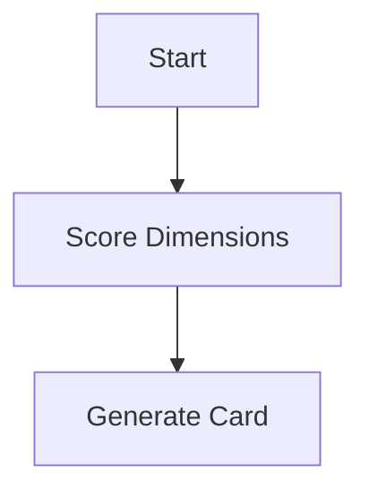

# AiCMM Documentation Site

A local web server that renders all AiCMM framework documentation with full Markdown and Mermaid diagram support.

## Features

- **Markdown Rendering** — All `.md` files rendered as styled HTML with GFM tables and heading anchors
- **Mermaid Diagrams** — Code blocks with ` ```mermaid ` are rendered as interactive diagrams
- **Agent Cards** — Visual display of capability fingerprints with score bars and radar charts
- **JSON Schema Viewer** — Browse the Agent Card schema with syntax highlighting
- **Navigation** — Direct links to Medium article, LinkedIn article, and GitHub repo
- **Responsive Design** — Works on desktop and mobile

## Quick Start

### Prerequisites

- Java 17+
- Maven 3.8+

### Build & Run

```bash
# From project root
mvn clean package -DskipTests

# Start the documentation site
java -jar aicmm-site/target/aicmm-site-0.1.0-SNAPSHOT.jar
```

Open **http://localhost:8080** in your browser.

### Options

```bash
java -jar aicmm-site-0.1.0-SNAPSHOT.jar --port 3000        # Custom port
java -jar aicmm-site-0.1.0-SNAPSHOT.jar --docs-root /path  # Custom docs directory
```

## Site Pages

| URL | Page | Description |
|-----|------|-------------|
| `/` | Home | Project README with overview |
| `/framework` | Framework | Full AiCMM framework specification (Medium article) |
| `/docs/articles/introduction-linkedin.md` | Introduction | LinkedIn introductory article |
| `/docs/diagrams/architecture.md` | Architecture | System diagrams with Mermaid |
| `/agent-cards` | Agent Cards | Browse all evaluated agent profiles |
| `/agent-cards/{name}` | Card Detail | Individual agent with radar chart |
| `/schema` | Schema | Agent Card JSON Schema reference |

## External Links (in Navigation)

- 📝 **Medium** — [Full Framework Article](https://medium.com/@sureshchande/agent-capability-maturity-model-a-unified-framework-for-evaluating-modern-ai-agents-bcb5b7a64bd7)
- 💼 **LinkedIn** — [Introduction Article](https://www.linkedin.com/pulse/all-ai-agents-same-so-why-do-we-treat-them-like-suresh-chande-oxgqc/)

## API Endpoints

| Endpoint | Description |
|----------|-------------|
| `GET /api/docs` | List all documentation files (JSON) |
| `GET /api/agent-cards` | List all agent cards with scores (JSON) |

## Adding Content

### New Documentation
Add `.md` files to `docs/` — they're automatically available at `/docs/<path>`.

### New Agent Cards
Add `.json` files to `examples/` following `schemas/agent-card.schema.json` — they appear on the Agent Cards page.

### Mermaid Diagrams
Use fenced code blocks with `mermaid` language:

````markdown

````

## Technology Stack

- **Javalin 6** — Lightweight web framework
- **CommonMark** — Markdown to HTML (GFM tables, heading anchors)
- **Mermaid.js** — Client-side diagram rendering (loaded from CDN)
- **Jackson** — JSON processing for Agent Cards
- **Maven Shade** — Fat JAR for easy distribution
