<div align="center">

# 🧠 AiCMM — Agent Capability Maturity Model

### *The Universal Framework for Evaluating, Classifying, and Governing AI Agents*

[](https://github.com/snchande/Arima-AiCMM)
[](LICENSE)
[](https://openjdk.org)
[](#)

---

*"Not all AI agents are the same — so why do we treat them like they are?"*

**AiCMM** provides a standardized, multi-dimensional capability profile for every AI agent — from simple chatbots to autonomous robotic fleets. One framework. One language. Universal comparison.

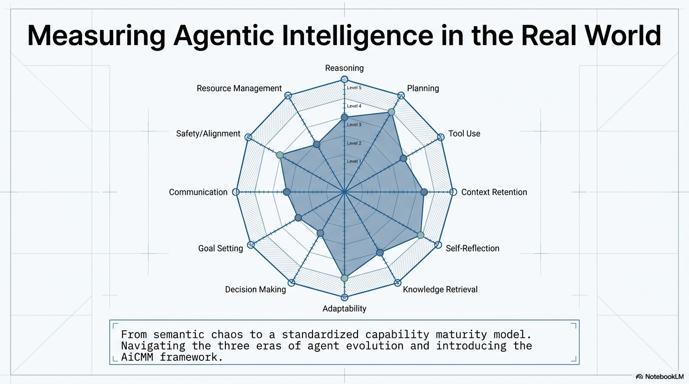

</div>

---

## 📋 Table of Contents

1. [What is AiCMM?](#what-is-aicmm)
2. [The 12-Dimension Framework](#the-12-dimension-framework)
3. [Architecture Overview](#architecture-overview)
4. [Getting Started](#getting-started)
5. [Creating Your First Agent Card](#creating-your-first-agent-card)
6. [The Web Interface](#the-web-interface)
7. [MCP Integration](#mcp-integration)
8. [CLI Agents & Skills](#cli-agents--skills)
9. [Copy-Paste CLI Recipes](#-copy-paste-cli-recipes)
10. [Agent Card Examples](#agent-card-examples)
11. [Standards Integration (A2A, MCP, OpenAI)](#standards-integration)
12. [Governance & Validation](#governance--validation)
13. [Level 1: Domain-Specific Scoring](#level-1-domain-specific-scoring)
14. [API Reference](#api-reference)
15. [Contributing](#contributing)

---

## What is AiCMM?

AiCMM is an **open-source framework** that creates a universal "capability resume" for AI agents. Think of it as a professional credential system for AI — just as humans have certifications and skill profiles, AI agents deserve standardized capability descriptions.

### The Problem

Today's AI ecosystem has:
- 🤖 Thousands of AI agents with no standard way to describe capabilities
- ❓ No way to compare agents objectively
- 🚫 No governance framework for autonomous systems
- 📊 No standardized "maturity level" for AI capabilities

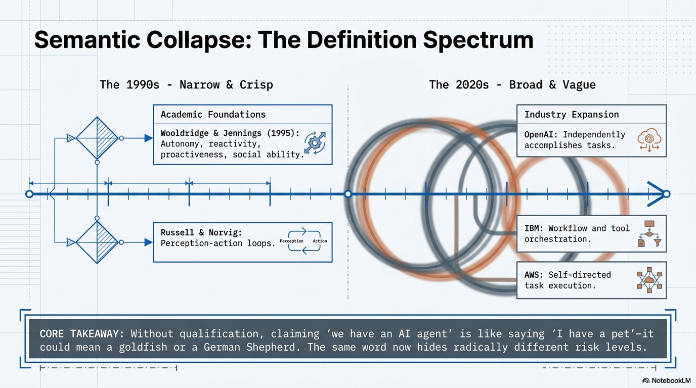

### The Solution

AiCMM provides:
- ✅ **12-dimension scoring** (Level 0) — Universal capability profile
- ✅ **Domain-specific scoring** (Level 1) — Industry drill-downs
- ✅ **7 governance rules** — Safety and accountability constraints
- ✅ **Agent Cards** — Portable, embeddable capability descriptions
- ✅ **Standards integration** — Works with A2A, MCP, OpenAI protocols

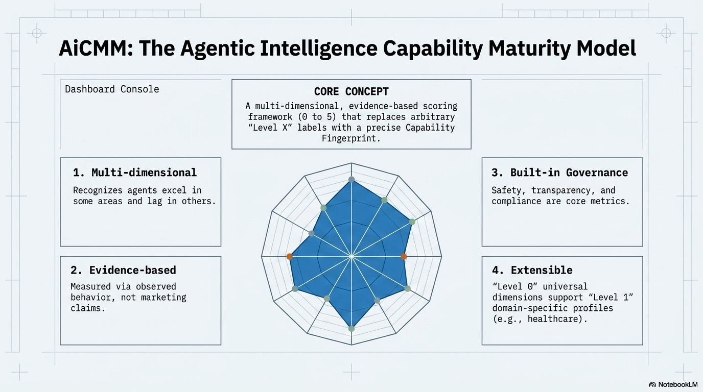

---

## The 12-Dimension Framework

AiCMM evaluates every AI agent across **12 fixed-position dimensions**, grouped into three logical areas:

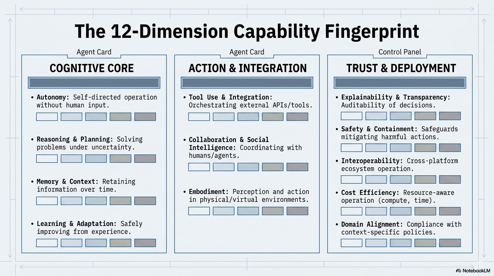

```mermaid
graph LR
    subgraph CognitiveCore["Cognitive Core 0-3"]
        A[0: Autonomy]
        B[1: Reasoning]
        C[2: Memory]
        D[3: Learning]
    end
    subgraph ActionIntegration["Action and Integration 4-6"]
        E[4: Tool Use]
        F[5: Collaboration]
        G[6: Embodiment]
    end
    subgraph TrustDeployment["Trust and Deployment 7-11"]
        H[7: Explainability]
        I[8: Safety]
        J[9: Interoperability]
        K[10: Cost Efficiency]
        L[11: Domain Alignment]
    end
    CognitiveCore --> ActionIntegration --> TrustDeployment
```

### Dimension Details

| Pos | Dimension | Key Question | Score Range |
|:---:|-----------|-------------|:-----------:|
| 0 | **Autonomy** | How self-directed is it? | 0-5 |
| 1 | **Reasoning** | Can it solve problems under uncertainty? | 0-5 |
| 2 | **Memory** | Does it retain and use information over time? | 0-5 |
| 3 | **Learning** | Does it improve from experience safely? | 0-5 |
| 4 | **Tool Use** | Can it orchestrate tools and handle failures? | 0-5 |
| 5 | **Collaboration & Social Intelligence** | Does it coordinate with humans/agents? | 0-5 |
| 6 | **Embodiment** | Does it interact with the physical world? | 0-5 |
| 7 | **Explainability** | Can it explain decisions transparently? | 0-5 |
| 8 | **Safety** | Does it operate safely with guardrails? | 0-5 |
| 9 | **Interoperability** | Does it follow standards (A2A, MCP)? | 0-5 |
| 10 | **Cost Efficiency** | Is it resource-efficient and cost-aware? | 0-5 |
| 11 | **Domain Alignment** | Is it compliant, auditable, deployable? | 0-5 |

### Scoring Scale

| Score | Level | What It Means |
|:-----:|-------|---------------|
| 0 | **Absent** | Capability not present |
| 1 | **Basic** | Single hardcoded behavior |
| 2 | **Intermediate** | Structured but limited |
| 3 | **Advanced** | Handles complexity with guardrails |
| 4 | **Expert** | Autonomous within boundaries |
| 5 | **Mastery** | Full autonomy with self-governance |

---

## The Agency Qualification Layer (Position 12 — Derived)

> *"Is this even an agent — and if so, how agentic is it?"*

The 12 dimensions describe *what a system can do*. The **Agency Qualification Layer** is a
**derived 13th dimension** that sits on top of them and answers a different question: **whether
the system qualifies as a genuine agent at all, and where it lands on an evolutionary ladder.**
It is *computed automatically* from the 12 scores plus the 7 governance rules — never authored
by hand — so a glorified script can't be marketed as an "agent," and a truly autonomous system
gets the recognition it earns.

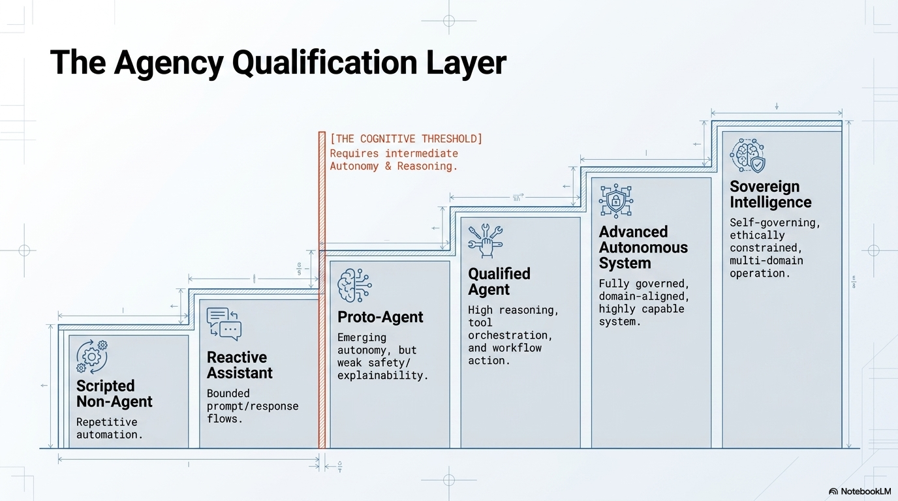

A system is an **agent** (level ≥ 0) only when **Autonomy ≥ 2 and Reasoning ≥ 2**. Anything
below that lands on the negative **non-agent** rungs.

| Level | Label | What It Is | Agent? |
|------:|-------|-----------|:------:|
| **−2** | Scripted Automation | RPA, ETL pipelines, deterministic scripts | ❌ |
| **−1** | Reactive Assistant | FAQ bots, early Siri/Alexa, basic Q&A LLM | ❌ |
| **0** | Proto-Agent | Emerging agency, fails trust/governance (e.g. AutoGPT) | ✅ |
| **1** | Basic Agent | Qualified, balanced, passes governance | ✅ |
| **2** | Advanced Agent | Autonomous & trust-aligned (Copilot CLI, MedAssist, Tesla FSD) | ✅ |
| **3** | Generalized Agent | Cutting-edge, broad capability across domains | ✅ |
| **4** | Human-Level Agent | Human-level general intelligence | ✅ |
| **5** | Humanoid Agent | Indistinguishable from a human — synthetic skin, touch, taste | ✅ |

Levels 4 and 5 are *forward-looking*: Level 4 marks human-level cognition, and Level 5 marks
the point at which appearance, touch, and presence can no longer be distinguished from a real
human — the trajectory robotics is on today. The layer is exposed via the API
(`GET /api/agency-levels`) and the MCP tool `aicmm_get_agency_levels`.

### The Agency Barometer (Weighted Index)

The discrete level above is the **authoritative band**. For visualization, AiCMM also derives a
continuous **Agency Index (0–100)** — a weighted aggregate of the twelve scores that emphasizes
the *agentic drivers* (autonomy, reasoning, tool use). It renders as a horizontal **barometer
strip** on every Agent Card: colored zones for each ladder level, and a needle whose position on
the signed −2…+5 scale shows momentum toward the next level (or below zero for non-agents).

> **Live from the catalog — GitHub Copilot CLI's barometer:**
>
> 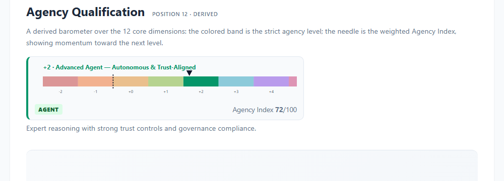

| Dim | Weight | Dim | Weight | Dim | Weight |
|-----|:------:|-----|:------:|-----|:------:|
| Autonomy | 0.20 | Tool Use | 0.12 | Safety | 0.07 |
| Reasoning | 0.18 | Collaboration | 0.07 | Domain Alignment | 0.04 |
| Memory | 0.10 | Explainability | 0.07 | Interoperability | 0.03 |
| Learning | 0.08 | Embodiment | 0.02 | Cost Efficiency | 0.02 |

```java
// org.aicmm.scoring.AgencyClassifier
double[] W = {0.20,0.18,0.10,0.08,0.12,0.07,0.02,0.07,0.07,0.03,0.02,0.04};
int agencyIndex(int[] s) {            // s = the 12 scores, position order 0–11
    double acc = 0;
    for (int i = 0; i < 12; i++) acc += W[i] * s[i];
    return (int) Math.round(100.0 * acc / 5.0);   // 0..100
}
```

The barometer needle and Agency Index appear in the `agencyQualification` block of every card:

```json
"agencyQualification": {
  "position": 12,
  "dimension": "Agency Qualification",
  "derived": true,
  "level": 2,
  "code": "ADVANCED_AGENT",
  "label": "Advanced Agent — Autonomous & Trust-Aligned",
  "isAgent": true,
  "governancePass": true,
  "index": 72,
  "needle": 2.17,
  "rationale": "Expert reasoning with strong trust controls and governance compliance."
}
```

```bash
# Fetch the full ladder, or compute a reading by validating a profile
curl -s http://localhost:8080/api/agency-levels | jq '.ladder[].label'
curl -s -X POST http://localhost:8080/api/validate \
  -H "Content-Type: application/json" -d @examples/copilot-cli-agent-card.json \
  | jq '.agencyQualification | {level, index, needle, code}'
# → { "level": 2, "index": 72, "needle": 2.17, "code": "ADVANCED_AGENT" }
```

**Example readings:** Copilot CLI → `+2` Advanced, Index 72 · AutoNav → `+3` Generalized, Index 79 ·
an RPA macro → `−2` Scripted Automation (NON-AGENT), needle below zero.

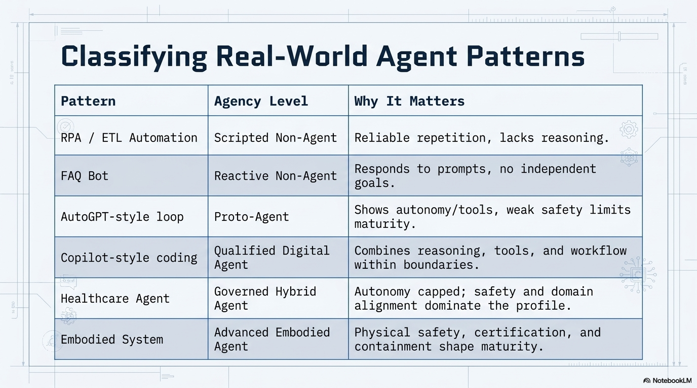

### Three Generations of Agent Evolution

AiCMM is a common lens across the **three eras of agent evolution**:

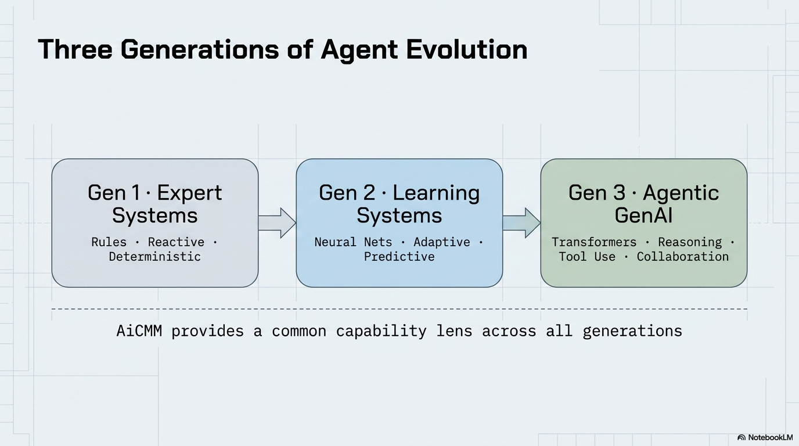

| Generation | Era | Hallmarks | Example Systems |
|-----------|-----|-----------|-----------------|
| **Gen 1 — Classical / Expert Systems** | 1990s | Hand-coded rules, reactive, deterministic | Expert systems, rule engines |
| **Gen 2 — Distributed / Learning Systems** | 2000s–2010s | Neural nets, adaptive, enterprise integration | Early Siri/Alexa, recommendation engines |
| **Gen 3 — Modern Agentic GenAI** | 2020s | Transformers/LLMs, reasoning, tool use, collaboration | Copilot, AutoGPT, agentic assistants |

The 12 dimensions measure capability uniformly across all three generations; the Agency
Qualification Layer then places every system — from a Gen 1 script to a Gen 3 autonomous
agent — on a single, comparable ladder.

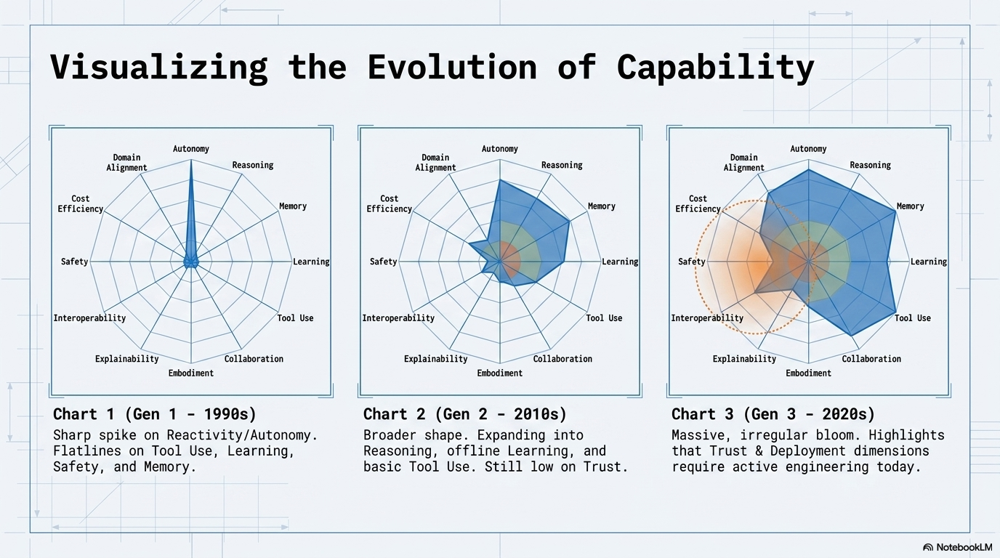

---

## Architecture Overview

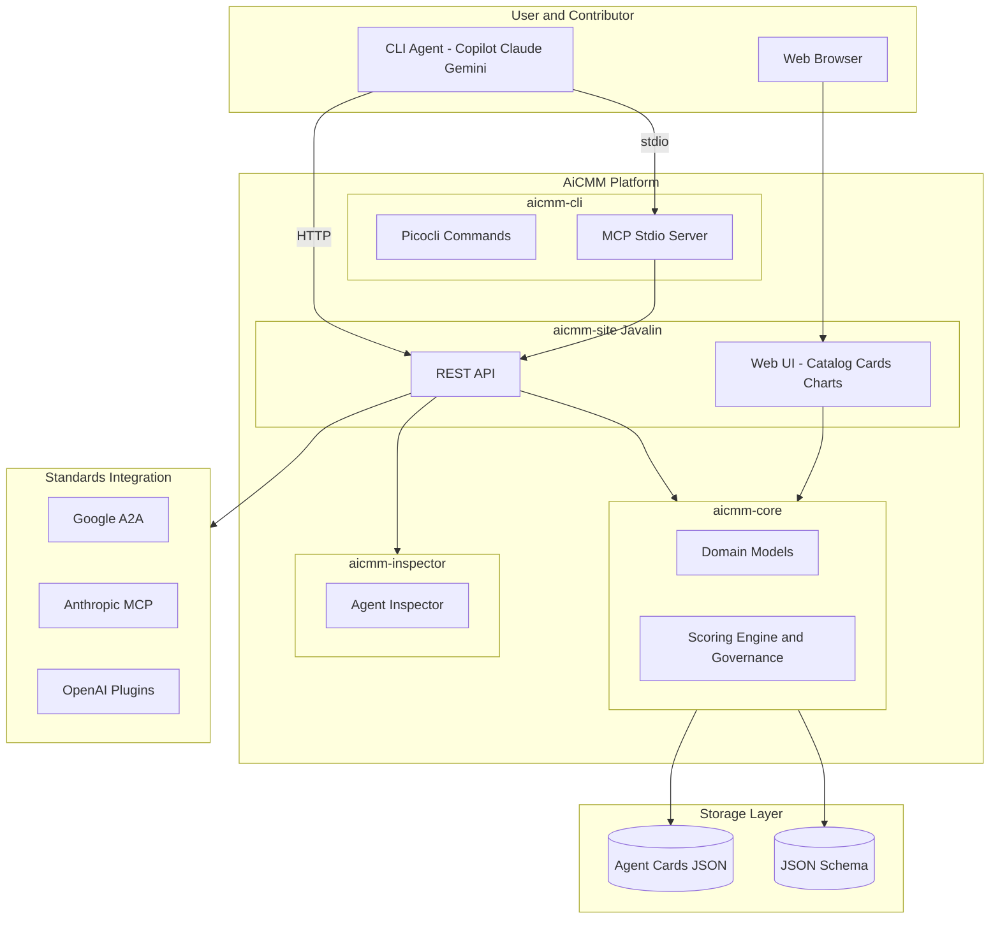

### Component Responsibilities

| Component | Responsibility | Technology |
|-----------|---------------|------------|
| **aicmm-core** | Domain models, scoring engine, governance rules | Java 17, Jackson |
| **aicmm-inspector** | Agent investigation from URLs/docs | Java, HTTP client |
| **aicmm-cli** | CLI commands + MCP stdio server | Picocli, fat JAR |
| **aicmm-site** | Web UI + REST API | Javalin, SVG charts |
| **examples/** | Agent Card catalog (JSON files) | JSON, Schema v0.2.0 |

---

## Getting Started

### Prerequisites

- **Java 17+** (OpenJDK or Oracle)
- **Maven 3.8+**
- No Node.js, Python, or other runtimes needed

### Installation

```bash
# Clone the repository
git clone https://github.com/snchande/Arima-AiCMM.git
cd Arima-AiCMM

# Build (creates all JARs)
mvn clean package -DskipTests

# Start the AiCMM server
java -jar aicmm-site/target/aicmm-site-0.1.0-SNAPSHOT.jar
```

**That's it!** Open http://localhost:8080 in your browser.

### Verify Installation

```bash
# Check the API
curl http://localhost:8080/api/dimensions | jq '.level0 | length'
# → 12

# List the catalog
curl http://localhost:8080/api/agent-cards | jq '.[].name'
# → "GitHub Copilot CLI", "MedAssist Pro", "AutoNav Fleet Commander", ...

# Validate an agent card
curl -X POST http://localhost:8080/api/validate \
  -H "Content-Type: application/json" \
  -d @examples/copilot-cli-agent-card.json | jq .valid
# → true
```

---

## Creating Your First Agent Card

### Option 1: Web Interface

1. Navigate to http://localhost:8080/create-card
2. Fill in agent details (name, vendor, category)
3. Score each of the 12 dimensions with evidence
4. Add tools, skills, plugins, MCP connections
5. Click **Generate** → Downloads the card JSON
6. Submit via the catalog page or API

### Option 2: API (Programmatic)

```bash
curl -X POST http://localhost:8080/api/agent-cards \
  -H "Content-Type: application/json" \
  -d '{
    "schemaVersion": "0.2.0",
    "agent": {
      "name": "My Custom Agent",
      "version": "1.0.0",
      "vendor": "My Company",
      "category": "digital",
      "description": "A specialized agent for customer support"
    },
    "capabilityProfile": {
      "autonomy": {"position": 0, "score": 3, "confidence": "high", "evidence": "Handles tickets independently, escalates edge cases"},
      "reasoning": {"position": 1, "score": 3, "confidence": "high", "evidence": "Classifies issues, suggests resolutions from knowledge base"},
      "memory": {"position": 2, "score": 2, "confidence": "medium", "evidence": "Session context only, no cross-ticket memory"},
      "learning": {"position": 3, "score": 1, "confidence": "medium", "evidence": "Static model, no real-time learning"},
      "toolUse": {"position": 4, "score": 4, "confidence": "high", "evidence": "CRM, ticketing, knowledge base, email APIs"},
      "collaboration": {"position": 5, "score": 3, "confidence": "high", "evidence": "Human handoff, team routing, sentiment detection"},
      "embodiment": {"position": 6, "score": 0, "confidence": "high", "evidence": "Pure software agent"},
      "explainability": {"position": 7, "score": 3, "confidence": "medium", "evidence": "Shows reasoning steps, cites sources"},
      "safety": {"position": 8, "score": 3, "confidence": "high", "evidence": "Content filters, PII redaction, escalation triggers"},
      "interoperability": {"position": 9, "score": 3, "confidence": "medium", "evidence": "REST APIs, webhook integrations"},
      "costEfficiency": {"position": 10, "score": 3, "confidence": "medium", "evidence": "Token caching, batch processing"},
      "domainAlignment": {"position": 11, "score": 3, "confidence": "high", "evidence": "GDPR compliant, audit logging"}
    },
    "tools": ["Zendesk API", "Confluence", "Slack", "Email"],
    "skills": ["Ticket Classification", "Response Generation", "Escalation"],
    "plugins": ["Sentiment Analyzer", "Auto-Translator"],
    "mcps": ["crm-mcp-server", "knowledge-base-mcp"]
  }'
```

### Option 3: CLI Agent (Copilot/Claude/Gemini)

After cloning the repo, your CLI automatically has the `@aicmm` agent:

```
> @aicmm Create an agent card for ChatGPT

✅ Inspecting ChatGPT capabilities...
✅ Scoring 12 dimensions...
✅ Governance validation: PASSED (7/7 rules)
✅ Agent Card saved to examples/chatgpt-agent-card.json
✅ Registered in catalog
   View at: http://localhost:8080/agent-cards/chatgpt-agent-card
```

### Option 4: MCP Integration

```bash
# Start MCP stdio server
java -jar aicmm-cli/target/aicmm-cli-0.1.0-SNAPSHOT.jar --mcp

# Send MCP tool call
echo '{"jsonrpc":"2.0","id":1,"method":"tools/call","params":{
  "name":"aicmm_inspect_agent",
  "arguments":{"url":"https://docs.agent.example.com","name":"Example Agent"}
}}' | java -jar aicmm-cli/target/aicmm-cli-0.1.0-SNAPSHOT.jar --mcp
```

---

## The Web Interface

### 🏠 Home Page (`/`)
Framework overview with architecture diagrams, quick links to all sections.

### 📊 Catalog (`/catalog`)
Browse all registered Agent Cards. Filter by:
- **Category**: Digital, Embodied, Hybrid
- **Score range**: Minimum average score
- **Search**: By name or vendor

Each card shows a mini radar chart for quick visual comparison.

### 🎴 Agent Card View (`/agent-cards/{name}`)
Full agent card with:
- **Radar Chart** — 12 dimensions grouped by color (purple=Cognitive, blue=Action, green=Trust)
- **Avatar** — Professional hexagonal emblem with orbital rings showing capability nodes
- **Capabilities Grid** — Tools, Skills, Plugins, MCPs, Delegates, Used By
- **Governance Table** — 7 rules with pass/fail status
- **Level 1 Chart** — Domain-specific radar (if applicable)
- **Standards Integration** — A2A, MCP, OpenAI embedding details

### ✏️ Create Card (`/create-card`)
Interactive form with:
- Agent details input
- Dimension sliders (0-5) with evidence fields
- Live preview of radar chart
- Download as JSON or copy to clipboard

### 📐 Architecture (`/architecture`)
Mermaid diagrams showing system design and data flow.

### 📖 User Guide (`/user-guide`)
Step-by-step instructions for all operations.

---

## MCP Integration

AiCMM exposes a **Model Context Protocol (MCP)** server for seamless integration with AI coding assistants.

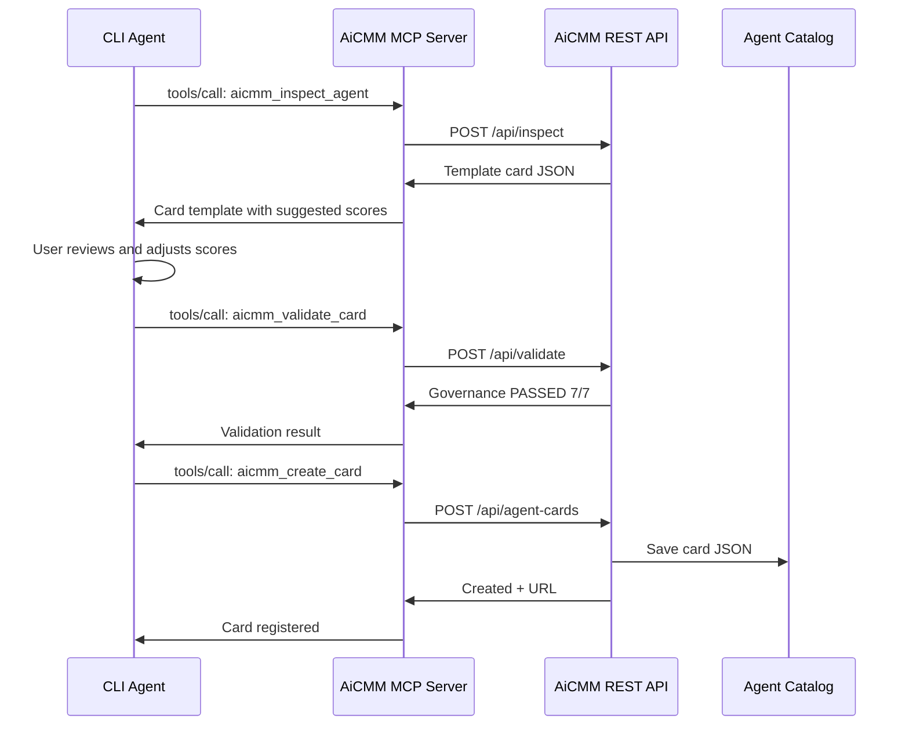

### MCP Configuration

#### For Claude Code (auto-detected)
The `.mcp.json` in the project root is auto-detected:
```json
{
  "mcpServers": {
    "aicmm": {
      "command": "java",
      "args": ["-jar", "aicmm-cli/target/aicmm-cli-0.1.0-SNAPSHOT.jar", "--mcp"],
      "env": { "AICMM_API_URL": "http://localhost:8080/api" }
    }
  }
}
```

#### For Copilot CLI
The in-repo `.copilot/agents/aicmm.md` provides full agent capabilities.

#### For Gemini CLI
The `GEMINI.md` file provides framework context and instructions.

### Available MCP Tools

| Tool | Purpose |
|------|---------|
| `aicmm_create_card` | Create and register a new Agent Card |
| `aicmm_inspect_agent` | Inspect agent from URL/description |
| `aicmm_validate_card` | Validate against 7 governance rules |
| `aicmm_score_card` | Get score breakdown + maturity level |
| `aicmm_list_cards` | Browse the catalog |
| `aicmm_get_card` | Get full card details |
| `aicmm_get_dimensions` | Get dimension definitions |
| `aicmm_get_agency_levels` | Get the Agency Qualification ladder (−2…+5) |
| `aicmm_get_schema` | Get JSON schema |

---

## CLI Agents & Skills

When you clone this repo, you get immediate access to AI-powered agents and skills through your preferred CLI:

### Agents (`.copilot/agents/`)

| Agent | Purpose |
|-------|---------|
| **@aicmm** | Create, score, validate, register Agent Cards |
| **@aicmm-contributor** | Navigate codebase, build, follow conventions |
| **@aicmm-reviewer** | Review cards for quality and governance |

### Using Agents

Agents are invoked by mentioning them in your CLI prompt. They work across **GitHub Copilot CLI**, **Claude Code**, and **Gemini CLI**.

#### @aicmm — Create and Manage Agent Cards

```
# Create a card from a URL
> @aicmm Create an agent card for the agent documented at https://docs.example.com/my-agent

# Score an existing card
> @aicmm Score the agent card in examples/copilot-cli-agent-card.json

# Validate governance rules
> @aicmm Validate governance for examples/medassist-pro-agent-card.json

# Register a card into the catalog
> @aicmm Register this agent card: { "name": "My Agent", ... }
```

#### From a Brochure/Docs → Agent Card + Footprint

Feed any product brochure, README, or API page and let the CLI score all 12 dimensions, run governance, and produce the radar fingerprint and Agency footprint:

```
# 1. Build the card from a brochure (PDF, URL, or pasted text)
> @aicmm Create an AiCMM Agent Card from this brochure: ./mybot-brochure.pdf
> @aicmm Build a card for the agent at https://acme.ai/product; save to examples/

# 2. Produce the Agent Footprint (radar + Agency level + index)
> @aicmm Score examples/mybot-agent-card.json and show the radar fingerprint
> @aicmm What Agency level and Agency Index does mybot reach, and why?

# 3. Close gaps to the next Agency level
> @aicmm Which dimensions block mybot from BASIC_AGENT, and what evidence raises them?
```

#### @aicmm-contributor — Development Help

```
# Build the project
> @aicmm-contributor How do I build and test the project?

# Understand module structure
> @aicmm-contributor Explain how the scoring engine works in aicmm-core

# Add a new feature
> @aicmm-contributor I want to add a new REST endpoint for bulk card import
```

#### @aicmm-reviewer — Quality Assurance

```
# Review a card for completeness
> @aicmm-reviewer Review this agent card for quality and completeness

# Check governance compliance
> @aicmm-reviewer Does this card pass all 7 governance rules? Flag any issues.

# Compare two agents
> @aicmm-reviewer Compare copilot-cli and medassist-pro agent cards
```

### Skills (`.copilot/skills/`)

Skills are specialized workflows you invoke directly. They focus on one task and provide structured outputs.

| Skill | Purpose | Invocation |
|-------|---------|------------|
| **create-agent-card** | Full card creation workflow | `/create-agent-card` or ask @aicmm |
| **register-agent-card** | Validate and register existing cards | `/register-agent-card` |
| **score-agent** | 12-dimension scoring with governance | `/score-agent` |
| **inspect-agent** | Investigate agent capabilities | `/inspect-agent` |
| **validate-governance** | Check 7 governance rules | `/validate-governance` |
| **compare-agents** | Side-by-side comparison | `/compare-agents` |
| **add-level1-domain** | Extend with new industry domains | `/add-level1-domain` |
| **build-and-test** | Build, test, and verify | `/build-and-test` |

### Skill Usage Examples

#### create-agent-card

```
> /create-agent-card
Agent URL or description: https://github.com/features/copilot
Agent name: GitHub Copilot

Output:
✅ Inspected agent capabilities
✅ Scored 12 dimensions: [4,4,3,2,5,3,0,4,4,4,3,4]
✅ Governance validation: PASSED (7/7)
✅ Generated avatar: "The Code Companion"
✅ Saved to examples/github-copilot-agent-card.json
```

#### score-agent

```
> /score-agent examples/my-agent-card.json

┌────────────────────────────────┬───────┬────────────────────────────┐
│ Dimension                      │ Score │ Evidence                   │
├────────────────────────────────┼───────┼────────────────────────────┤
│ 0: Autonomy                    │ 3     │ Semi-autonomous with human │
│ 1: Reasoning                   │ 4     │ Multi-step problem solving │
│ 2: Memory                      │ 2     │ Session context only       │
│ 3: Learning                    │ 1     │ No persistent adaptation   │
│ 4: Tool Use                    │ 5     │ Multi-tool orchestration   │
│ 5: Collaboration               │ 3     │ Human-AI pair programming  │
│ 6: Embodiment                  │ 0     │ Pure digital agent         │
│ 7: Explainability              │ 4     │ Explains all suggestions   │
│ 8: Safety                      │ 4     │ Content filtering + scope  │
│ 9: Interoperability            │ 4     │ LSP, MCP, API standards    │
│ 10: Cost Efficiency            │ 3     │ Token-aware, caching       │
│ 11: Domain Alignment           │ 4     │ Code-focused compliance    │
├────────────────────────────────┼───────┼────────────────────────────┤
│ TOTAL                          │ 37/60 │ Maturity: Advanced         │
└────────────────────────────────┴───────┴────────────────────────────┘

Governance: ✅ PASSED (7/7 rules)
```

#### validate-governance

```
> /validate-governance examples/my-agent-card.json

Rule 1: Autonomy(3) ≤ Reasoning(4) + 1  ✅ PASS
Rule 2: Autonomy(3) < 4, skip           ✅ N/A
Rule 3: Autonomy(3) < 4, skip           ✅ N/A
Rule 4: Collaboration(3) < 4, skip      ✅ N/A
Rule 5: ToolUse(5) ≥ 4 → CostEff(3) ≥ 2  ✅ PASS
Rule 6: Embodiment(0) < 3, skip         ✅ N/A
Rule 7: ToolUse(5) ≥ 4 → Reasoning(4) ≥ 3  ✅ PASS

Result: ✅ ALL GOVERNANCE RULES PASSED
```

#### compare-agents

```
> /compare-agents copilot-cli medassist-pro

┌────────────────────┬─────────────┬──────────────────┐
│ Dimension          │ Copilot CLI │ MedAssist Pro    │
├────────────────────┼─────────────┼──────────────────┤
│ Autonomy           │ 3           │ 4                │
│ Reasoning          │ 4           │ 5                │
│ Memory             │ 3           │ 4                │
│ ...                │ ...         │ ...              │
│ TOTAL              │ 37/60       │ 42/60            │
│ Category           │ Digital     │ Hybrid           │
└────────────────────┴─────────────┴──────────────────┘

Key Differences:
- MedAssist Pro scores higher in Reasoning (clinical diagnosis)
- Copilot CLI excels in Tool Use (multi-tool orchestration)
- MedAssist Pro has Level 1 Healthcare domain scoring
```

#### inspect-agent

```
> /inspect-agent --url https://docs.example.com/agent-api

Inspecting agent at: https://docs.example.com/agent-api
Detected capabilities:
  - REST API with 12 endpoints
  - OAuth2 authentication
  - Rate limiting and quotas
  - Webhook event handling
  - Multi-language support

Suggested scores: [2,3,1,0,4,2,0,3,3,4,3,3]
Suggested category: Digital
Suggested archetype: "The API Gateway"

Use /create-agent-card to generate the full card from these results.
```

#### add-level1-domain

```
> /add-level1-domain Healthcare

Adding Level 1 domain: Healthcare
Required sub-dimensions:
  1. Clinical Accuracy (0-5)
  2. Patient Safety (0-5)
  3. Regulatory Compliance (0-5)
  4. EHR Integration (0-5)
  5. Clinical Workflow (0-5)
  6. Medical Reasoning (0-5)

Provide scores for each sub-dimension to extend the agent card.
```

### MCP Tools — Programmatic Usage

For automated pipelines and custom integrations, use the MCP server directly:

```bash
# Start the MCP server (requires AiCMM site running on :8080)
java -jar aicmm-cli/target/aicmm-cli-0.1.0-SNAPSHOT.jar --mcp
```

#### Example: Scripted Agent Card Creation

```bash
# 1. Inspect an agent
echo '{"jsonrpc":"2.0","id":1,"method":"tools/call","params":{
  "name":"aicmm_inspect_agent",
  "arguments":{"url":"https://docs.myagent.io","name":"MyAgent"}
}}' | java -jar aicmm-cli/target/aicmm-cli-0.1.0-SNAPSHOT.jar --mcp

# 2. Validate the generated card
echo '{"jsonrpc":"2.0","id":2,"method":"tools/call","params":{
  "name":"aicmm_validate_card",
  "arguments":{"card":{"name":"MyAgent","scores":[3,3,2,1,4,2,0,3,3,3,3,3]}}
}}' | java -jar aicmm-cli/target/aicmm-cli-0.1.0-SNAPSHOT.jar --mcp

# 3. Register the card
echo '{"jsonrpc":"2.0","id":3,"method":"tools/call","params":{
  "name":"aicmm_create_card",
  "arguments":{"name":"MyAgent","description":"My custom agent","scores":[3,3,2,1,4,2,0,3,3,3,3,3]}
}}' | java -jar aicmm-cli/target/aicmm-cli-0.1.0-SNAPSHOT.jar --mcp
```

#### REST API Quick Reference

```bash
# List all agent cards
curl http://localhost:8080/api/agent-cards

# Get a specific card
curl http://localhost:8080/api/agent-cards/copilot-cli-agent-card

# Create a new card
curl -X POST http://localhost:8080/api/agent-cards \
  -H "Content-Type: application/json" \
  -d @examples/my-agent-card.json

# Validate governance
curl -X POST http://localhost:8080/api/validate \
  -H "Content-Type: application/json" \
  -d '{"scores":[4,4,3,2,5,3,0,4,4,4,3,4]}'

# Score breakdown
curl -X POST http://localhost:8080/api/agent-cards/_/score \
  -H "Content-Type: application/json" \
  -d @examples/copilot-cli-agent-card.json

# Inspect from URL
curl -X POST http://localhost:8080/api/inspect \
  -H "Content-Type: application/json" \
  -d '{"url":"https://docs.example.com/agent","name":"ExampleAgent"}'

# Get dimension definitions
curl http://localhost:8080/api/dimensions

# Get JSON schema
curl http://localhost:8080/api/schema
```

---

## 📋 Copy-Paste CLI Recipes

Ready-to-use prompts for your favorite CLI. Just clone the repo and start typing:

```bash
git clone https://github.com/snchande/Arima-AiCMM.git && cd Arima-AiCMM
```

### 🟣 GitHub Copilot CLI

```
@aicmm Create an agent card for Claude Code by inspecting https://docs.anthropic.com/en/docs/claude-code
```

```
@aicmm Score the agent at examples/copilot-cli-agent-card.json and show a full dimension breakdown
```

```
@aicmm Validate governance rules for this agent with scores [4,4,3,2,5,3,0,4,4,4,3,4]
```

```
@aicmm Inspect the agent at https://github.com/features/copilot and suggest AiCMM scores
```

```
@aicmm Create an agent card for my custom chatbot. It answers customer questions using RAG over our docs. It has no memory between sessions, uses 3 tools (search, summarize, escalate), and requires human approval for escalations.
```

```
@aicmm Compare copilot-cli-agent-card and medassist-pro-agent-card side by side
```

```
@aicmm List all agent cards in the catalog with their maturity levels
```

```
@aicmm Add Level 1 Healthcare scoring to the medassist-pro agent card
```

```
@aicmm-contributor How do I add a new REST endpoint to the site module?
```

```
@aicmm-contributor Run the full build and test suite and tell me if anything fails
```

```
@aicmm-reviewer Review the agent card at examples/autonav-fleet-agent-card.json for governance compliance and completeness
```

### 🟠 Claude Code

```
@aicmm Create an agent card for Devin by inspecting https://docs.devin.ai
```

```
@aicmm I have an agent that does automated code review. It reads PRs, analyzes diffs, suggests fixes, and can auto-apply approved changes. Score it across all 12 dimensions.
```

```
@aicmm Generate an agent card for a financial trading bot. It executes trades autonomously within risk limits, uses ML for predictions, integrates with Bloomberg API, and has real-time portfolio monitoring.
```

```
@aicmm Validate this card and fix any governance violations:
{
  "name": "AutoTrader",
  "scores": [5, 3, 4, 3, 4, 2, 0, 2, 2, 3, 3, 4]
}
```

```
@aicmm What Level 1 domains are available? Add Education domain scoring to my tutoring agent.
```

```
@aicmm-contributor Explain the MCP server architecture and how tools/call requests are routed
```

```
@aicmm-reviewer Does the autonav-fleet card correctly represent an embodied agent? Check all scores make sense for a self-driving fleet system.
```

### 🔵 Gemini CLI

```
@aicmm Create an agent card for Google Gemini by inspecting https://ai.google.dev/gemini-api/docs
```

```
@aicmm Score a customer service chatbot that: handles 5 languages, escalates to humans after 3 failed attempts, uses sentiment analysis, integrates with Zendesk and Salesforce, has no learning capability.
```

```
@aicmm Create a card for our internal DevOps agent. It monitors deployments, auto-rolls back failures, sends Slack alerts, manages Kubernetes scaling, and logs all decisions for audit.
```

```
@aicmm Inspect https://platform.openai.com/docs/assistants and create a full agent card with avatar and capabilities
```

```
@aicmm-contributor I want to add a new governance rule. Where do I modify the validation logic?
```

```
@aicmm-reviewer Review all 5 agent cards in the catalog and rank them by maturity level
```

### 🛠️ Universal Skill Prompts (Works in Any CLI)

These prompts invoke the in-repo skills directly:

#### Create a card from scratch
```
Create an AiCMM agent card for [AGENT NAME].
Description: [what the agent does]
Tools it uses: [list tools]
Key capabilities: [list capabilities]
Deployment context: [where/how it runs]
```

#### Score any AI system
```
Score this AI system using AiCMM 12 dimensions:
- Name: [system name]
- What it does: [description]
- Autonomy level: [how self-directed]
- Tools it uses: [tool list]
- Safety measures: [safety features]
- Who uses it: [humans, other agents, both]
```

#### Quick governance check
```
Check AiCMM governance for scores: [autonomy, reasoning, memory, learning, toolUse, collaboration, embodiment, explainability, safety, interoperability, costEfficiency, domainAlignment]
```

#### Compare two agents
```
Compare these two agents using AiCMM:
Agent A: [name or path to card]
Agent B: [name or path to card]
Show dimension-by-dimension comparison with strengths and gaps.
```

#### Inspect from URL
```
Inspect the agent documented at [URL] and suggest AiCMM scores with evidence for each dimension.
```

#### Add domain scoring
```
Add Level 1 [Healthcare/Finance/Transportation/Manufacturing/Education/Customer Service] scoring to the agent card at [path].
```

### 💻 Shell Commands (No AI CLI Required)

```bash
# Start the AiCMM server
cd Arima-AiCMM
mvn clean package -DskipTests
java -jar aicmm-site/target/aicmm-site-0.1.0-SNAPSHOT.jar

# Open web UI
open http://localhost:8080

# Create card via API
curl -X POST http://localhost:8080/api/agent-cards \
  -H "Content-Type: application/json" \
  -d '{
    "name": "my-agent",
    "description": "My custom agent",
    "category": "Digital",
    "scores": [3, 3, 2, 1, 4, 2, 0, 3, 3, 3, 3, 3],
    "tools": ["search", "summarize"],
    "skills": ["question-answering"]
  }'

# Validate governance
curl -X POST http://localhost:8080/api/validate \
  -H "Content-Type: application/json" \
  -d '{"scores": [3, 3, 2, 1, 4, 2, 0, 3, 3, 3, 3, 3]}'

# Inspect an agent from URL
curl -X POST http://localhost:8080/api/inspect \
  -H "Content-Type: application/json" \
  -d '{"url": "https://docs.example.com/agent", "name": "Example Agent"}'

# List catalog
curl http://localhost:8080/api/agent-cards | python -m json.tool

# Start MCP server for programmatic access
java -jar aicmm-cli/target/aicmm-cli-0.1.0-SNAPSHOT.jar --mcp
```

---

## Agent Card Examples

*Real cards rendered live on the AiCMM catalog — radar fingerprint, governance, and Agency Barometer:*

### 🖥️ Digital Agent: GitHub Copilot CLI

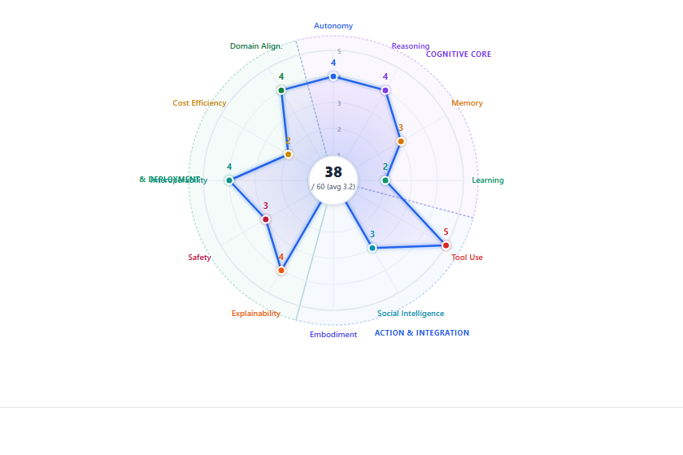

```
Category: Digital | Maturity: Expert | Average: 3.5/5

Radar Profile:
  Autonomy:        ████░ 4    Explainability:  ███░░ 3
  Reasoning:       ████░ 4    Safety:          ████░ 4
  Memory:          ███░░ 3    Interoperability:████░ 4
  Learning:        ██░░░ 2    Cost Efficiency: ███░░ 3
  Tool Use:        █████ 5    Domain Alignment:███░░ 3
  Collaboration:   ███░░ 3    Embodiment:      ░░░░░ 0

Governance: ✅ ALL 7 RULES PASSED
Tools: grep, glob, view, edit, create, powershell, git, web_search, sql, task
MCPs: github-mcp-server, filesystem-mcp, session-store-mcp
```

### 🏥 Hybrid Agent: MedAssist Pro

```
Category: Hybrid | Maturity: Advanced | Average: 3.3/5

Level 1 Domain: Healthcare (10 dimensions)
  Clinical Accuracy:   ████░ 4    Empathy:          ████░ 4
  Patient Safety:      █████ 5    Inclusivity:      ███░░ 3
  Diagnostic Support:  ████░ 4    EHR Integration:  ████░ 4
  Treatment Planning:  ███░░ 3    Triage Accuracy:  ████░ 4

MCPs: hl7-fhir-mcp, clinical-decision-support-mcp, pharmacy-interaction-mcp
```

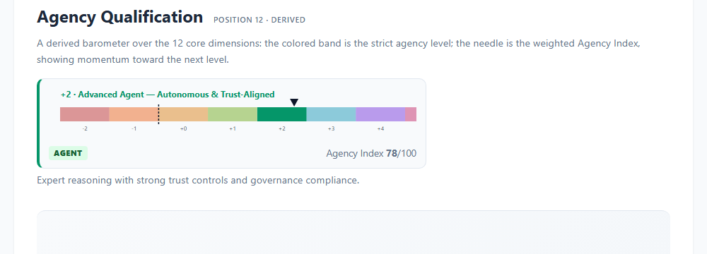

### 🚗 Embodied Agent: AutoNav Fleet Commander

```
Category: Embodied | Maturity: Expert | Average: 3.8/5

Notable: Embodiment=5, Safety=5, Autonomy=4
Level 1 Domain: Transportation (8 dimensions)

Governance: ✅ ALL 7 RULES PASSED
  - Autonomy(4) ≤ Reasoning(4)+1 ✅
  - Embodiment(5) → Domain Alignment(4)≥3 ✅
```

---

## Standards Integration

AiCMM Agent Cards are designed to embed into existing AI protocols:

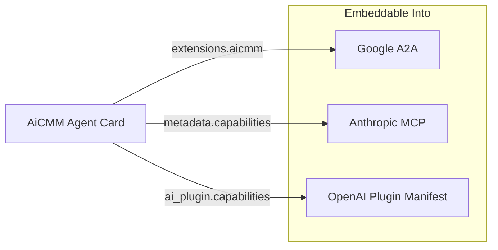

### A2A Integration Example

```json
{
  "name": "My Agent",
  "description": "...",
  "extensions": {
    "aicmm": {
      "schemaVersion": "0.2.0",
      "capabilityProfile": { ... },
      "governanceStatus": "PASSED",
      "maturityLevel": "Advanced"
    }
  }
}
```

### MCP Server Description

```json
{
  "name": "my-agent-mcp",
  "metadata": {
    "aicmm_profile": {
      "autonomy": 3,
      "reasoning": 4,
      "toolUse": 5
    },
    "aicmm_governance": "PASSED"
  }
}
```

---

## Governance & Validation

AiCMM enforces **7 mandatory governance rules** that ensure responsible AI deployment:

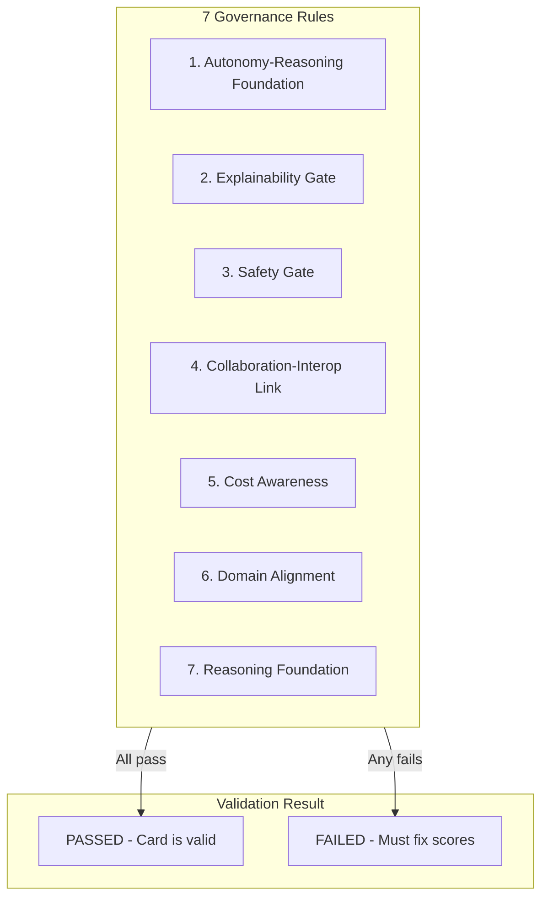

| # | Rule | Condition | Why It Matters |
|---|------|-----------|---------------|
| 1 | **Autonomy-Reasoning** | Autonomy ≤ Reasoning + 1 | Can't act beyond what you can reason about |
| 2 | **Explainability Gate** | Autonomy ≥ 4 → Explainability ≥ 3 | High autonomy demands transparency |
| 3 | **Safety Gate** | Autonomy ≥ 4 → Safety ≥ 3 | High autonomy demands safety controls |
| 4 | **Collaboration-Interop** | Collaboration ≥ 4 → Interoperability ≥ 3 | Can't collaborate without protocols |
| 5 | **Cost Awareness** | Tool Use ≥ 4 → Cost Efficiency ≥ 2 | Heavy tool use needs resource awareness |
| 6 | **Domain Alignment** | Embodiment ≥ 3 → Domain Alignment ≥ 3 | Physical agents need domain compliance |
| 7 | **Reasoning Foundation** | Tool Use ≥ 4 → Reasoning ≥ 3 | Complex tools need reasoning ability |

---

## Level 1: Domain-Specific Scoring

Beyond the universal 12-dimension Level 0, AiCMM supports **Level 1 domain-specific drill-downs**:

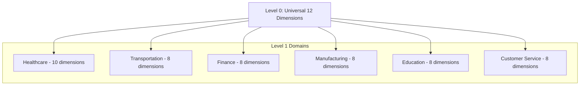

### Available Level 1 Domains

| Domain | Dimensions | Special Considerations |
|--------|:----------:|----------------------|
| **Healthcare** | 10 | Includes Empathy & Inclusivity (age-appropriate care) |
| **Transportation** | 8 | V2X Communication, Fleet Coordination |
| **Finance** | 8 | Fraud Detection, Audit Trail compliance |
| **Manufacturing** | 8 | Predictive Maintenance, Quality Control |
| **Education** | 8 | Includes Empathy & Inclusivity (adaptive learning) |
| **Customer Service** | 8 | Includes Empathy & Inclusivity (sentiment-aware) |

### Adding Your Own Domain

Use the `add-level1-domain` skill or follow the pattern in `docs/specifications/dimension-ordering.md`.

---

## API Reference

### Base URL: `http://localhost:8080/api`

| Method | Endpoint | Purpose | Request Body |
|--------|----------|---------|:------------:|
| **POST** | `/api/agent-cards` | Create & register card | Agent Card JSON |
| **GET** | `/api/agent-cards` | List all cards | — |
| **GET** | `/api/agent-cards/{name}` | Get specific card | — |
| **POST** | `/api/validate` | Validate governance | Agent Card JSON |
| **POST** | `/api/agent-cards/_/score` | Score breakdown | Agent Card JSON |
| **POST** | `/api/inspect` | Inspect from URL/desc | `{url, description, name}` |
| **GET** | `/api/dimensions` | Dimension definitions | — |
| **GET** | `/api/agency-levels` | Agency Qualification ladder (−2…+5) | — |
| **GET** | `/api/schema` | JSON Schema (v0.2.0) | — |

### Response Examples

**Score Breakdown:**
```json
{
  "scores": {
    "autonomy": {"group": "Cognitive Core", "label": "Autonomy", "score": 4, "position": 0},
    "reasoning": {"group": "Cognitive Core", "label": "Reasoning", "score": 4, "position": 1},
    ...
  },
  "totalScore": 42,
  "maxPossible": 60,
  "average": 3.5,
  "maturityLevel": "Expert",
  "dimensionCount": 12
}
```

**Governance Validation:**
```json
{
  "valid": true,
  "schemaValid": true,
  "governanceValid": true,
  "checks": [
    {"field": "Autonomy-Reasoning Foundation", "passed": true, "detail": "Autonomy(4) ≤ Reasoning(4) + 1"},
    {"field": "Explainability Gate", "passed": true, "detail": "Autonomy(4) → Explainability(3) ≥ 3"},
    ...
  ]
}
```

---

## Contributing

We welcome contributions! AiCMM is designed for community-driven evolution.

### Quick Start for Contributors

```bash
git clone https://github.com/snchande/Arima-AiCMM.git
cd Arima-AiCMM
mvn clean package -DskipTests
java -jar aicmm-site/target/aicmm-site-0.1.0-SNAPSHOT.jar
# Open http://localhost:8080
```

### What You Can Contribute

| Area | Examples |
|------|---------|
| **New Domains** | Add Level 1 dimensions for Legal, Agriculture, Retail, Energy |
| **Agent Cards** | Profile new agents and submit to the catalog |
| **Governance Rules** | Propose new safety/accountability constraints |
| **Integrations** | Connect AiCMM to new standards and protocols |
| **Documentation** | Improve guides, add tutorials, translate |
| **Code** | Core scoring engine, inspector, CLI, web UI |

### In-Repo AI Assistance

After cloning, you automatically get:
- **3 AI agents** — For creating cards, contributing code, reviewing submissions
- **8 AI skills** — For scoring, validation, comparison, and more
- **MCP server** — Programmatic access to all capabilities
- **REST API** — For custom tooling and integration

### Commit Conventions

```
feat: Add new feature
fix: Fix a bug
docs: Documentation changes
chore: Maintenance tasks
```

---

<div align="center">

## 🚀 Start Using AiCMM Today

```bash
git clone https://github.com/snchande/Arima-AiCMM.git && cd Arima-AiCMM && mvn package -DskipTests && java -jar aicmm-site/target/aicmm-site-0.1.0-SNAPSHOT.jar
```

**Open http://localhost:8080** and create your first Agent Card!

---

*Created by [Suresh Chande](https://github.com/snchande) | Apache 2.0 License | [GitHub](https://github.com/snchande/Arima-AiCMM)*

</div>
