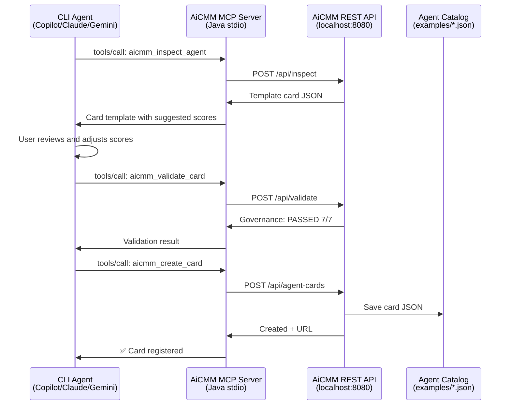
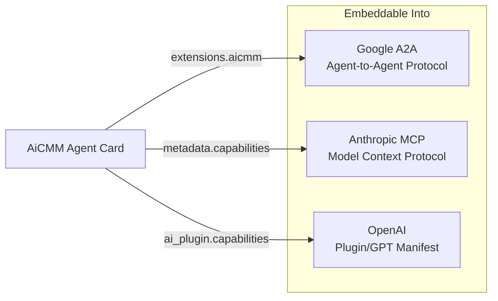
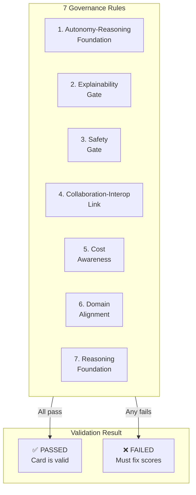
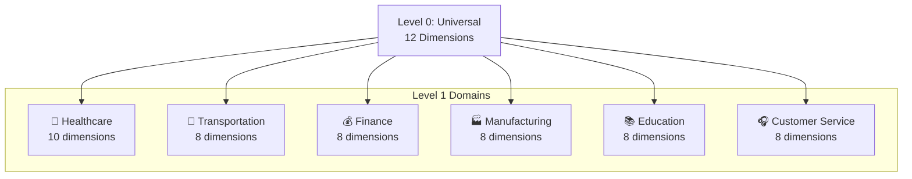

<div align="center">

# 🧠 AiCMM — Agent Capability Maturity Model

### *The Universal Framework for Evaluating, Classifying, and Governing AI Agents*

[](https://github.com/snchande/Arima-AiCMM)
[](LICENSE)
[](https://openjdk.org)
[](#)

---

*"Not all AI agents are the same — so why do we treat them like they are?"*

**AiCMM** provides a standardized, multi-dimensional capability profile for every AI agent — from simple chatbots to autonomous robotic fleets. One framework. One language. Universal comparison.

</div>

---

## 📋 Table of Contents

1. [What is AiCMM?](#what-is-aicmm)
2. [The 12-Dimension Framework](#the-12-dimension-framework)
3. [Architecture Overview](#architecture-overview)
4. [Getting Started](#getting-started)
5. [Creating Your First Agent Card](#creating-your-first-agent-card)
6. [The Web Interface](#the-web-interface)
7. [MCP Integration](#mcp-integration)
8. [CLI Agents & Skills](#cli-agents--skills)
9. [Agent Card Examples](#agent-card-examples)
10. [Standards Integration (A2A, MCP, OpenAI)](#standards-integration)
11. [Governance & Validation](#governance--validation)
12. [Level 1: Domain-Specific Scoring](#level-1-domain-specific-scoring)
13. [API Reference](#api-reference)
14. [Contributing](#contributing)

---

## What is AiCMM?

AiCMM is an **open-source framework** that creates a universal "capability resume" for AI agents. Think of it as a professional credential system for AI — just as humans have certifications and skill profiles, AI agents deserve standardized capability descriptions.

### The Problem

Today's AI ecosystem has:
- 🤖 Thousands of AI agents with no standard way to describe capabilities
- ❓ No way to compare agents objectively
- 🚫 No governance framework for autonomous systems
- 📊 No standardized "maturity level" for AI capabilities

### The Solution

AiCMM provides:
- ✅ **12-dimension scoring** (Level 0) — Universal capability profile
- ✅ **Domain-specific scoring** (Level 1) — Industry drill-downs
- ✅ **7 governance rules** — Safety and accountability constraints
- ✅ **Agent Cards** — Portable, embeddable capability descriptions
- ✅ **Standards integration** — Works with A2A, MCP, OpenAI protocols

---

## The 12-Dimension Framework

AiCMM evaluates every AI agent across **12 fixed-position dimensions**, grouped into three logical areas:

```mermaid
graph LR
    subgraph CognitiveCore["🧠 Cognitive Core (0-3)"]
        A[0: Autonomy]
        B[1: Reasoning]
        C[2: Memory]
        D[3: Learning]
    end

    subgraph ActionIntegration["⚡ Action & Integration (4-6)"]
        E[4: Tool Use]
        F[5: Collaboration]
        G[6: Embodiment]
    end

    subgraph TrustDeployment["🛡️ Trust & Deployment (7-11)"]
        H[7: Explainability]
        I[8: Safety]
        J[9: Interoperability]
        K[10: Cost Efficiency]
        L[11: Domain Alignment]
    end

    CognitiveCore --> ActionIntegration --> TrustDeployment
```



### Dimension Details

| Pos | Dimension | Key Question | Score Range |
|:---:|-----------|-------------|:-----------:|
| 0 | **Autonomy** | How self-directed is it? | 0-5 |
| 1 | **Reasoning** | Can it solve problems under uncertainty? | 0-5 |
| 2 | **Memory** | Does it retain and use information over time? | 0-5 |
| 3 | **Learning** | Does it improve from experience safely? | 0-5 |
| 4 | **Tool Use** | Can it orchestrate tools and handle failures? | 0-5 |
| 5 | **Collaboration & Social Intelligence** | Does it coordinate with humans/agents? | 0-5 |
| 6 | **Embodiment** | Does it interact with the physical world? | 0-5 |
| 7 | **Explainability** | Can it explain decisions transparently? | 0-5 |
| 8 | **Safety** | Does it operate safely with guardrails? | 0-5 |
| 9 | **Interoperability** | Does it follow standards (A2A, MCP)? | 0-5 |
| 10 | **Cost Efficiency** | Is it resource-efficient and cost-aware? | 0-5 |
| 11 | **Domain Alignment** | Is it compliant, auditable, deployable? | 0-5 |

### Scoring Scale

| Score | Level | What It Means |
|:-----:|-------|---------------|
| 0 | **Absent** | Capability not present |
| 1 | **Basic** | Single hardcoded behavior |
| 2 | **Intermediate** | Structured but limited |
| 3 | **Advanced** | Handles complexity with guardrails |
| 4 | **Expert** | Autonomous within boundaries |
| 5 | **Mastery** | Full autonomy with self-governance |

---

## Architecture Overview

```mermaid
graph TB
    subgraph User["👤 User / Contributor"]
        CLI[CLI Agent<br/>Copilot / Claude / Gemini]
        Browser[Web Browser]
    end

    subgraph AiCMMPlatform["🏗️ AiCMM Platform"]
        subgraph Site["aicmm-site (Javalin)"]
            WebUI[Web UI<br/>Catalog • Cards • Charts]
            API[REST API<br/>"/api/*"]
        end

        subgraph Core["aicmm-core"]
            Models[Domain Models<br/>Dimensions • Profiles • Cards]
            Scoring[Scoring Engine<br/>Governance Validator]
        end

        subgraph CLIModule["aicmm-cli"]
            PicoCLI[Picocli Commands]
            MCP[MCP Stdio Server]
        end

        subgraph Inspector["aicmm-inspector"]
            Inspect[Agent Inspector<br/>URL • Docs • A2A]
        end
    end

    subgraph Storage["💾 Storage"]
        Cards[(Agent Cards<br/>examples/*.json)]
        Schema[(JSON Schema<br/>schemas/)]
    end

    subgraph Standards["🌐 Standards"]
        A2A[Google A2A]
        MCPStd[Anthropic MCP]
        OpenAI[OpenAI Plugins]
    end

    CLI -->|stdio| MCP
    Browser --> WebUI
    CLI -->|HTTP| API
    MCP --> API
    API --> Core
    API --> Inspector
    WebUI --> Core
    Core --> Cards
    Core --> Schema
    API --> Standards
```

### Component Responsibilities

| Component | Responsibility | Technology |
|-----------|---------------|------------|
| **aicmm-core** | Domain models, scoring engine, governance rules | Java 17, Jackson |
| **aicmm-inspector** | Agent investigation from URLs/docs | Java, HTTP client |
| **aicmm-cli** | CLI commands + MCP stdio server | Picocli, fat JAR |
| **aicmm-site** | Web UI + REST API | Javalin, SVG charts |
| **examples/** | Agent Card catalog (JSON files) | JSON, Schema v0.2.0 |

---

## Getting Started

### Prerequisites

- **Java 17+** (OpenJDK or Oracle)
- **Maven 3.8+**
- No Node.js, Python, or other runtimes needed

### Installation

```bash
# Clone the repository
git clone https://github.com/snchande/Arima-AiCMM.git
cd Arima-AiCMM

# Build (creates all JARs)
mvn clean package -DskipTests

# Start the AiCMM server
java -jar aicmm-site/target/aicmm-site-0.1.0-SNAPSHOT.jar
```

**That's it!** Open http://localhost:8080 in your browser.

### Verify Installation

```bash
# Check the API
curl http://localhost:8080/api/dimensions | jq '.level0 | length'
# → 12

# List the catalog
curl http://localhost:8080/api/agent-cards | jq '.[].name'
# → "GitHub Copilot CLI", "MedAssist Pro", "AutoNav Fleet Commander", ...

# Validate an agent card
curl -X POST http://localhost:8080/api/validate \
  -H "Content-Type: application/json" \
  -d @examples/copilot-cli-agent-card.json | jq .valid
# → true
```

---

## Creating Your First Agent Card

### Option 1: Web Interface

1. Navigate to http://localhost:8080/create-card
2. Fill in agent details (name, vendor, category)
3. Score each of the 12 dimensions with evidence
4. Add tools, skills, plugins, MCP connections
5. Click **Generate** → Downloads the card JSON
6. Submit via the catalog page or API

### Option 2: API (Programmatic)

```bash
curl -X POST http://localhost:8080/api/agent-cards \
  -H "Content-Type: application/json" \
  -d '{
    "schemaVersion": "0.2.0",
    "agent": {
      "name": "My Custom Agent",
      "version": "1.0.0",
      "vendor": "My Company",
      "category": "digital",
      "description": "A specialized agent for customer support"
    },
    "capabilityProfile": {
      "autonomy": {"position": 0, "score": 3, "confidence": "high", "evidence": "Handles tickets independently, escalates edge cases"},
      "reasoning": {"position": 1, "score": 3, "confidence": "high", "evidence": "Classifies issues, suggests resolutions from knowledge base"},
      "memory": {"position": 2, "score": 2, "confidence": "medium", "evidence": "Session context only, no cross-ticket memory"},
      "learning": {"position": 3, "score": 1, "confidence": "medium", "evidence": "Static model, no real-time learning"},
      "toolUse": {"position": 4, "score": 4, "confidence": "high", "evidence": "CRM, ticketing, knowledge base, email APIs"},
      "collaboration": {"position": 5, "score": 3, "confidence": "high", "evidence": "Human handoff, team routing, sentiment detection"},
      "embodiment": {"position": 6, "score": 0, "confidence": "high", "evidence": "Pure software agent"},
      "explainability": {"position": 7, "score": 3, "confidence": "medium", "evidence": "Shows reasoning steps, cites sources"},
      "safety": {"position": 8, "score": 3, "confidence": "high", "evidence": "Content filters, PII redaction, escalation triggers"},
      "interoperability": {"position": 9, "score": 3, "confidence": "medium", "evidence": "REST APIs, webhook integrations"},
      "costEfficiency": {"position": 10, "score": 3, "confidence": "medium", "evidence": "Token caching, batch processing"},
      "domainAlignment": {"position": 11, "score": 3, "confidence": "high", "evidence": "GDPR compliant, audit logging"}
    },
    "tools": ["Zendesk API", "Confluence", "Slack", "Email"],
    "skills": ["Ticket Classification", "Response Generation", "Escalation"],
    "plugins": ["Sentiment Analyzer", "Auto-Translator"],
    "mcps": ["crm-mcp-server", "knowledge-base-mcp"]
  }'
```

### Option 3: CLI Agent (Copilot/Claude/Gemini)

After cloning the repo, your CLI automatically has the `@aicmm` agent:

```
> @aicmm Create an agent card for ChatGPT

✅ Inspecting ChatGPT capabilities...
✅ Scoring 12 dimensions...
✅ Governance validation: PASSED (7/7 rules)
✅ Agent Card saved to examples/chatgpt-agent-card.json
✅ Registered in catalog
   View at: http://localhost:8080/agent-cards/chatgpt-agent-card
```

### Option 4: MCP Integration

```bash
# Start MCP stdio server
java -jar aicmm-cli/target/aicmm-cli-0.1.0-SNAPSHOT.jar --mcp

# Send MCP tool call
echo '{"jsonrpc":"2.0","id":1,"method":"tools/call","params":{
  "name":"aicmm_inspect_agent",
  "arguments":{"url":"https://docs.agent.example.com","name":"Example Agent"}
}}' | java -jar aicmm-cli/target/aicmm-cli-0.1.0-SNAPSHOT.jar --mcp
```

---

## The Web Interface

### 🏠 Home Page (`/`)
Framework overview with architecture diagrams, quick links to all sections.

### 📊 Catalog (`/catalog`)
Browse all registered Agent Cards. Filter by:
- **Category**: Digital, Embodied, Hybrid
- **Score range**: Minimum average score
- **Search**: By name or vendor

Each card shows a mini radar chart for quick visual comparison.

### 🎴 Agent Card View (`/agent-cards/{name}`)
Full agent card with:
- **Radar Chart** — 12 dimensions grouped by color (purple=Cognitive, blue=Action, green=Trust)
- **Avatar** — Professional hexagonal emblem with orbital rings showing capability nodes
- **Capabilities Grid** — Tools, Skills, Plugins, MCPs, Delegates, Used By
- **Governance Table** — 7 rules with pass/fail status
- **Level 1 Chart** — Domain-specific radar (if applicable)
- **Standards Integration** — A2A, MCP, OpenAI embedding details

### ✏️ Create Card (`/create-card`)
Interactive form with:
- Agent details input
- Dimension sliders (0-5) with evidence fields
- Live preview of radar chart
- Download as JSON or copy to clipboard

### 📐 Architecture (`/architecture`)
Mermaid diagrams showing system design and data flow.

### 📖 User Guide (`/user-guide`)
Step-by-step instructions for all operations.

---

## MCP Integration

AiCMM exposes a **Model Context Protocol (MCP)** server for seamless integration with AI coding assistants.



### MCP Configuration

#### For Claude Code (auto-detected)
The `.mcp.json` in the project root is auto-detected:
```json
{
  "mcpServers": {
    "aicmm": {
      "command": "java",
      "args": ["-jar", "aicmm-cli/target/aicmm-cli-0.1.0-SNAPSHOT.jar", "--mcp"],
      "env": { "AICMM_API_URL": "http://localhost:8080/api" }
    }
  }
}
```

#### For Copilot CLI
The in-repo `.copilot/agents/aicmm.md` provides full agent capabilities.

#### For Gemini CLI
The `GEMINI.md` file provides framework context and instructions.

### Available MCP Tools

| Tool | Purpose |
|------|---------|
| `aicmm_create_card` | Create and register a new Agent Card |
| `aicmm_inspect_agent` | Inspect agent from URL/description |
| `aicmm_validate_card` | Validate against 7 governance rules |
| `aicmm_score_card` | Get score breakdown + maturity level |
| `aicmm_list_cards` | Browse the catalog |
| `aicmm_get_card` | Get full card details |
| `aicmm_get_dimensions` | Get dimension definitions |
| `aicmm_get_schema` | Get JSON schema |

---

## CLI Agents & Skills

When you clone this repo, you get immediate access to AI-powered agents and skills through your preferred CLI:

### Agents (`.copilot/agents/`)

| Agent | Purpose |
|-------|---------|
| **@aicmm** | Create, score, validate, register Agent Cards |
| **@aicmm-contributor** | Navigate codebase, build, follow conventions |
| **@aicmm-reviewer** | Review cards for quality and governance |

### Skills (`.copilot/skills/`)

| Skill | Purpose |
|-------|---------|
| **create-agent-card** | Full card creation workflow |
| **register-agent-card** | Validate and register existing cards |
| **score-agent** | 12-dimension scoring with governance |
| **inspect-agent** | Investigate agent capabilities |
| **validate-governance** | Check 7 governance rules |
| **compare-agents** | Side-by-side comparison |
| **add-level1-domain** | Extend with new industry domains |
| **build-and-test** | Build, test, and verify |

---

## Agent Card Examples

### 🖥️ Digital Agent: GitHub Copilot CLI

```
Category: Digital | Maturity: Expert | Average: 3.5/5

Radar Profile:
  Autonomy:        ████░ 4    Explainability:  ███░░ 3
  Reasoning:       ████░ 4    Safety:          ████░ 4
  Memory:          ███░░ 3    Interoperability:████░ 4
  Learning:        ██░░░ 2    Cost Efficiency: ███░░ 3
  Tool Use:        █████ 5    Domain Alignment:███░░ 3
  Collaboration:   ███░░ 3    Embodiment:      ░░░░░ 0

Governance: ✅ ALL 7 RULES PASSED
Tools: grep, glob, view, edit, create, powershell, git, web_search, sql, task
MCPs: github-mcp-server, filesystem-mcp, session-store-mcp
```

### 🏥 Hybrid Agent: MedAssist Pro

```
Category: Hybrid | Maturity: Advanced | Average: 3.3/5

Level 1 Domain: Healthcare (10 dimensions)
  Clinical Accuracy:   ████░ 4    Empathy:          ████░ 4
  Patient Safety:      █████ 5    Inclusivity:      ███░░ 3
  Diagnostic Support:  ████░ 4    EHR Integration:  ████░ 4
  Treatment Planning:  ███░░ 3    Triage Accuracy:  ████░ 4

MCPs: hl7-fhir-mcp, clinical-decision-support-mcp, pharmacy-interaction-mcp
```

### 🚗 Embodied Agent: AutoNav Fleet Commander

```
Category: Embodied | Maturity: Expert | Average: 3.8/5

Notable: Embodiment=5, Safety=5, Autonomy=4
Level 1 Domain: Transportation (8 dimensions)

Governance: ✅ ALL 7 RULES PASSED
  - Autonomy(4) ≤ Reasoning(4)+1 ✅
  - Embodiment(5) → Domain Alignment(4)≥3 ✅
```

---

## Standards Integration

AiCMM Agent Cards are designed to embed into existing AI protocols:



### A2A Integration Example

```json
{
  "name": "My Agent",
  "description": "...",
  "extensions": {
    "aicmm": {
      "schemaVersion": "0.2.0",
      "capabilityProfile": { ... },
      "governanceStatus": "PASSED",
      "maturityLevel": "Advanced"
    }
  }
}
```

### MCP Server Description

```json
{
  "name": "my-agent-mcp",
  "metadata": {
    "aicmm_profile": {
      "autonomy": 3,
      "reasoning": 4,
      "toolUse": 5
    },
    "aicmm_governance": "PASSED"
  }
}
```

---

## Governance & Validation

AiCMM enforces **7 mandatory governance rules** that ensure responsible AI deployment:



| # | Rule | Condition | Why It Matters |
|---|------|-----------|---------------|
| 1 | **Autonomy-Reasoning** | Autonomy ≤ Reasoning + 1 | Can't act beyond what you can reason about |
| 2 | **Explainability Gate** | Autonomy ≥ 4 → Explainability ≥ 3 | High autonomy demands transparency |
| 3 | **Safety Gate** | Autonomy ≥ 4 → Safety ≥ 3 | High autonomy demands safety controls |
| 4 | **Collaboration-Interop** | Collaboration ≥ 4 → Interoperability ≥ 3 | Can't collaborate without protocols |
| 5 | **Cost Awareness** | Tool Use ≥ 4 → Cost Efficiency ≥ 2 | Heavy tool use needs resource awareness |
| 6 | **Domain Alignment** | Embodiment ≥ 3 → Domain Alignment ≥ 3 | Physical agents need domain compliance |
| 7 | **Reasoning Foundation** | Tool Use ≥ 4 → Reasoning ≥ 3 | Complex tools need reasoning ability |

---

## Level 1: Domain-Specific Scoring

Beyond the universal 12-dimension Level 0, AiCMM supports **Level 1 domain-specific drill-downs**:



### Available Level 1 Domains

| Domain | Dimensions | Special Considerations |
|--------|:----------:|----------------------|
| **Healthcare** | 10 | Includes Empathy & Inclusivity (age-appropriate care) |
| **Transportation** | 8 | V2X Communication, Fleet Coordination |
| **Finance** | 8 | Fraud Detection, Audit Trail compliance |
| **Manufacturing** | 8 | Predictive Maintenance, Quality Control |
| **Education** | 8 | Includes Empathy & Inclusivity (adaptive learning) |
| **Customer Service** | 8 | Includes Empathy & Inclusivity (sentiment-aware) |

### Adding Your Own Domain

Use the `add-level1-domain` skill or follow the pattern in `docs/specifications/dimension-ordering.md`.

---

## API Reference

### Base URL: `http://localhost:8080/api`

| Method | Endpoint | Purpose | Request Body |
|--------|----------|---------|:------------:|
| **POST** | `/api/agent-cards` | Create & register card | Agent Card JSON |
| **GET** | `/api/agent-cards` | List all cards | — |
| **GET** | `/api/agent-cards/{name}` | Get specific card | — |
| **POST** | `/api/validate` | Validate governance | Agent Card JSON |
| **POST** | `/api/agent-cards/_/score` | Score breakdown | Agent Card JSON |
| **POST** | `/api/inspect` | Inspect from URL/desc | `{url, description, name}` |
| **GET** | `/api/dimensions` | Dimension definitions | — |
| **GET** | `/api/schema` | JSON Schema (v0.2.0) | — |

### Response Examples

**Score Breakdown:**
```json
{
  "scores": {
    "autonomy": {"group": "Cognitive Core", "label": "Autonomy", "score": 4, "position": 0},
    "reasoning": {"group": "Cognitive Core", "label": "Reasoning", "score": 4, "position": 1},
    ...
  },
  "totalScore": 42,
  "maxPossible": 60,
  "average": 3.5,
  "maturityLevel": "Expert",
  "dimensionCount": 12
}
```

**Governance Validation:**
```json
{
  "valid": true,
  "schemaValid": true,
  "governanceValid": true,
  "checks": [
    {"field": "Autonomy-Reasoning Foundation", "passed": true, "detail": "Autonomy(4) ≤ Reasoning(4) + 1"},
    {"field": "Explainability Gate", "passed": true, "detail": "Autonomy(4) → Explainability(3) ≥ 3"},
    ...
  ]
}
```

---

## Contributing

We welcome contributions! AiCMM is designed for community-driven evolution.

### Quick Start for Contributors

```bash
git clone https://github.com/snchande/Arima-AiCMM.git
cd Arima-AiCMM
mvn clean package -DskipTests
java -jar aicmm-site/target/aicmm-site-0.1.0-SNAPSHOT.jar
# Open http://localhost:8080
```

### What You Can Contribute

| Area | Examples |
|------|---------|
| **New Domains** | Add Level 1 dimensions for Legal, Agriculture, Retail, Energy |
| **Agent Cards** | Profile new agents and submit to the catalog |
| **Governance Rules** | Propose new safety/accountability constraints |
| **Integrations** | Connect AiCMM to new standards and protocols |
| **Documentation** | Improve guides, add tutorials, translate |
| **Code** | Core scoring engine, inspector, CLI, web UI |

### In-Repo AI Assistance

After cloning, you automatically get:
- **3 AI agents** — For creating cards, contributing code, reviewing submissions
- **8 AI skills** — For scoring, validation, comparison, and more
- **MCP server** — Programmatic access to all capabilities
- **REST API** — For custom tooling and integration

### Commit Conventions

```
feat: Add new feature
fix: Fix a bug
docs: Documentation changes
chore: Maintenance tasks
```

---

<div align="center">

## 🚀 Start Using AiCMM Today

```bash
git clone https://github.com/snchande/Arima-AiCMM.git && cd Arima-AiCMM && mvn package -DskipTests && java -jar aicmm-site/target/aicmm-site-0.1.0-SNAPSHOT.jar
```

**Open http://localhost:8080** and create your first Agent Card!

---

*Created by [Suresh Chande](https://github.com/snchande) | Apache 2.0 License | [GitHub](https://github.com/snchande/Arima-AiCMM)*

</div>
