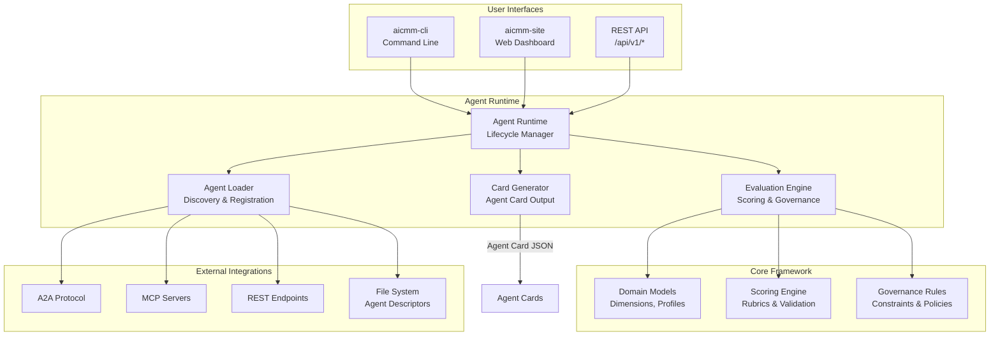
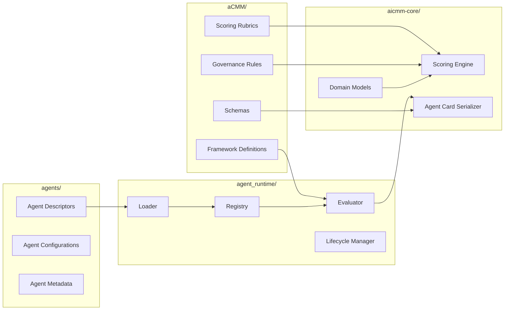
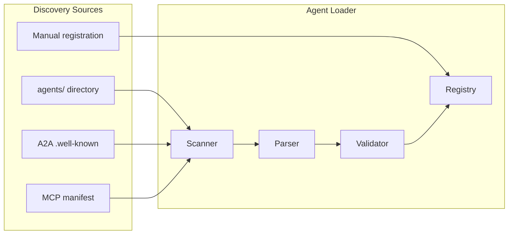
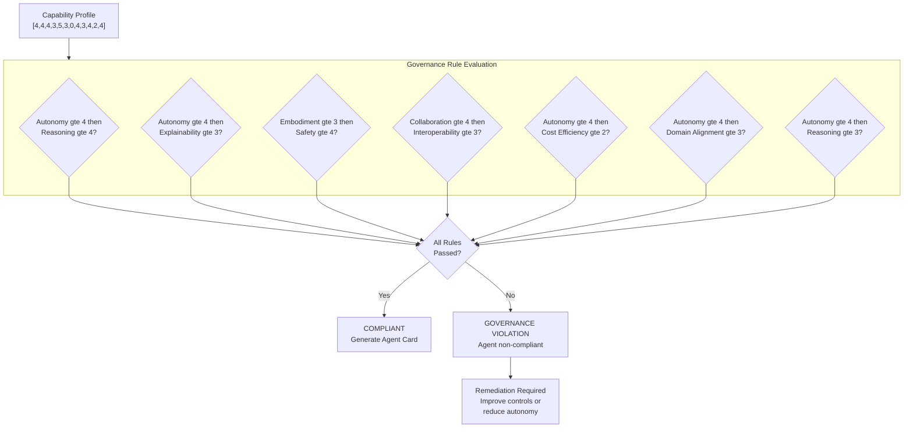
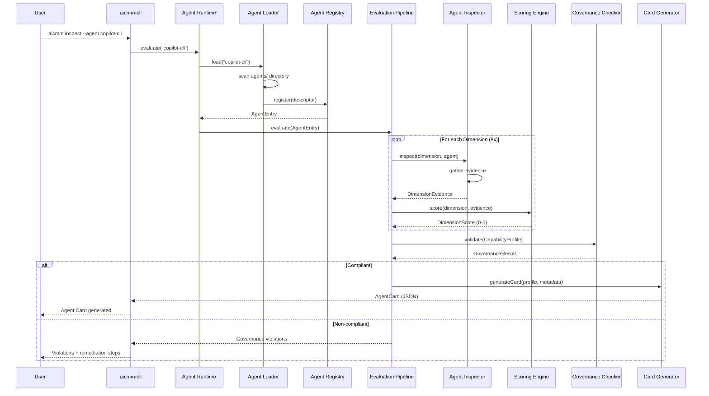
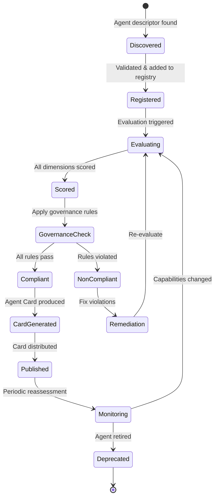
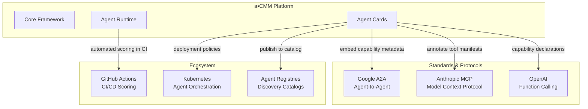
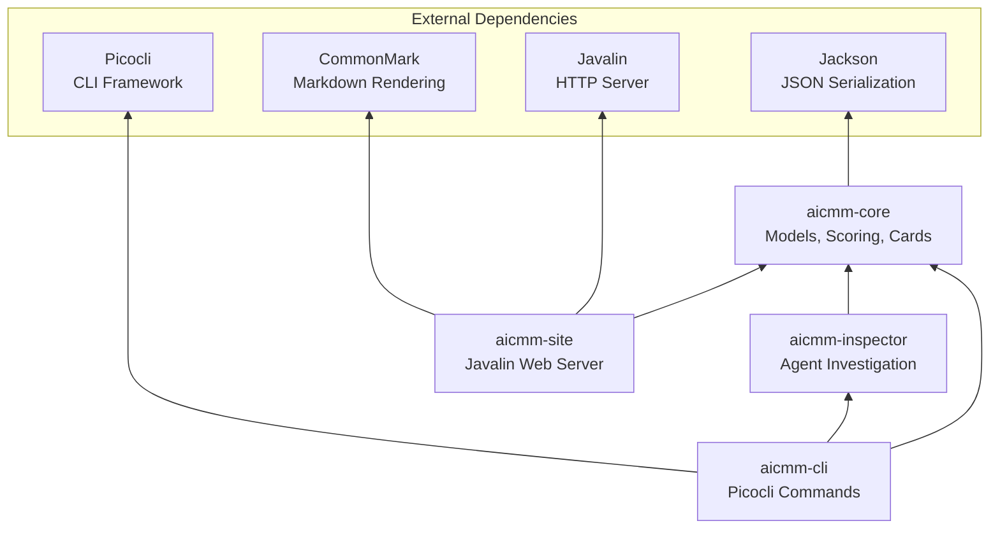

# a•CMM Platform Architecture

This document describes the internal architecture of the a•CMM agent platform — how agents are defined, loaded, evaluated, and how the runtime orchestrates the entire lifecycle.

---

## High-Level System Overview



---

## Directory Architecture

The platform organizes its concerns into four key directories that map to Maven modules:



---

## `agents/` — Agent Definitions

The `agents/` directory holds **agent descriptors** — structured definitions of agents to be evaluated. Each agent is defined as a YAML or JSON file describing what the agent is, where it can be reached, and any known capabilities.

```
agents/
├── digital/
│   ├── copilot-cli.yaml          # GitHub Copilot CLI descriptor
│   ├── chatgpt-4o.yaml           # OpenAI ChatGPT-4o
│   └── autogpt.yaml              # AutoGPT
├── embodied/
│   ├── boston-dynamics-spot.yaml  # Spot robot
│   └── amazon-prime-air.yaml     # Prime Air drone
├── hybrid/
│   ├── tesla-fsd.yaml            # Tesla Full Self-Driving
│   └── warehouse-robot.yaml      # Warehouse automation
└── _templates/
    └── agent-descriptor.yaml     # Template for new agents
```

### Agent Descriptor Schema

```yaml
# agents/digital/copilot-cli.yaml
name: "GitHub Copilot CLI"
version: "1.0.40"
vendor: "GitHub / Microsoft"
category: digital
description: "Terminal-based AI coding assistant with tool use"

# How to reach/inspect this agent
endpoints:
  type: local-cli
  command: "copilot --version"
  documentation: "https://docs.github.com/copilot"

# Pre-known capabilities (optional, for seeding evaluation)
declared_capabilities:
  tools: [shell, file-edit, git, web-search, grep]
  protocols: [MCP]
  delegation: true

# Metadata
tags: [coding, developer-tools, cli]
last_assessed: "2026-05-24"
```

### How Agents Are Discovered



---

## `aCMM/` — Framework Definitions

The `aCMM/` directory contains the **framework specification** itself — the scoring rubrics, governance rules, dimension definitions, and evaluation criteria that form the a•CMM standard.

```
aCMM/
├── dimensions/
│   ├── autonomy.md               # Level 0-5 rubric with evidence criteria
│   ├── reasoning-planning.md
│   ├── memory-context.md
│   ├── learning-adaptation.md
│   ├── tool-use-integration.md
│   ├── collaboration-social.md
│   ├── embodiment.md
│   ├── explainability.md
│   ├── safety.md
│   ├── interoperability.md
│   ├── cost-efficiency.md
│   └── domain-alignment.md
├── governance/
│   ├── rules.yaml                # Formal governance constraints
│   ├── compliance-matrix.md      # Mapping to regulatory frameworks
│   └── safety-classes.md         # Safety classification definitions
├── schemas/
│   ├── agent-card.schema.json    # Agent Card JSON Schema
│   ├── capability-profile.schema.json
│   └── agent-descriptor.schema.json
└── versions/
    ├── v0.2.0.md                 # Current version specification
    └── CHANGELOG.md              # Framework version history
```

### Governance Rules Engine



---

## `agent_runtime/` — Evaluation & Lifecycle

The `agent_runtime/` is the execution engine that loads agent descriptors, runs inspectors, evaluates capabilities, and produces Agent Cards. It manages the full lifecycle from discovery to card generation.

```
agent_runtime/
├── loader/
│   ├── AgentLoader.java          # Main loader — discovers & registers agents
│   ├── FileSystemScanner.java    # Scans agents/ directory
│   ├── A2ADiscovery.java         # Discovers via A2A protocol
│   └── MCPDiscovery.java         # Discovers via MCP manifests
├── registry/
│   ├── AgentRegistry.java        # In-memory registry of known agents
│   └── AgentEntry.java           # Registry entry with metadata
├── evaluator/
│   ├── EvaluationPipeline.java   # Orchestrates full evaluation
│   ├── DimensionEvaluator.java   # Per-dimension scoring logic
│   ├── EvidenceCollector.java    # Gathers evaluation evidence
│   └── GovernanceChecker.java    # Applies governance rules
├── lifecycle/
│   ├── AgentLifecycleManager.java  # State machine for agent lifecycle
│   └── ScheduledReassessment.java  # Periodic re-evaluation
└── output/
    ├── AgentCardWriter.java      # Writes Agent Card JSON
    ├── ReportGenerator.java      # Generates evaluation reports
    └── A2AEmitter.java           # Embeds into A2A protocol
```

### Agent Evaluation Pipeline



### Agent Lifecycle State Machine



---

## How the System Loads and Evaluates Agents

### 1. Discovery Phase

The runtime scans multiple sources for agent descriptors:

| Source | Method | Example |
|--------|--------|---------|
| **File System** | Scan `agents/` directory for YAML/JSON | `agents/digital/copilot-cli.yaml` |
| **A2A Protocol** | Query `.well-known/agent.json` endpoints | `https://agent.example.com/.well-known/agent.json` |
| **MCP Manifest** | Parse MCP server tool manifests | `mcp://server/tools` |
| **Manual** | User provides descriptor via CLI/API | `aicmm register --url ...` |

### 2. Registration Phase

Validated descriptors are added to the `AgentRegistry`:

```java
AgentEntry entry = AgentEntry.builder()
    .name(descriptor.getName())
    .version(descriptor.getVersion())
    .category(descriptor.getCategory())
    .endpoints(descriptor.getEndpoints())
    .status(AgentStatus.REGISTERED)
    .build();

registry.register(entry);
```

### 3. Evaluation Phase

The `EvaluationPipeline` orchestrates scoring across all 12 Level 0 dimensions:

```java
// For each dimension, select the appropriate inspector and score
for (Dimension dim : Dimension.values()) {
    Evidence evidence = inspector.gather(agent, dim);
    DimensionScore score = scoringEngine.evaluate(dim, evidence);
    profile.setScore(dim, score);
}
```

### 4. Governance Phase

The `GovernanceChecker` validates the profile against rules:

```java
List<GovernanceViolation> violations = governanceChecker.check(profile);
if (violations.isEmpty()) {
    // Proceed to card generation
} else {
    // Return violations with remediation guidance
}
```

### 5. Output Phase

Compliant profiles become Agent Cards:

```java
AgentCard card = AgentCard.builder()
    .name(entry.getName())
    .version(entry.getVersion())
    .category(entry.getCategory())
    .capabilityProfile(profile)
    .assessedBy(currentUser)
    .assessedDate(LocalDate.now())
    .build();

cardWriter.write(card, outputPath);
```

---

## Integration Points



---

## Module Dependency Graph



---

## Configuration

The platform is configured via `aicmm.yaml` at the project root:

```yaml
# aicmm.yaml
aicmm:
  version: "0.2.0"
  dimensionSchema: "level0-v0.2"

  # Where to scan for agent descriptors
  agents:
    directories:
      - agents/
      - ~/.aicmm/agents/
    remote:
      - url: "https://registry.example.com/agents"
        refresh: 24h

  # Governance rules
  governance:
    rules:
      - autonomy_reasoning_foundation: 4     # if autonomy >= 4, reasoning must be >= 4
      - autonomy_explainability_gate: 3      # if autonomy >= 4, explainability must be >= 3
      - embodiment_safety_gate: 4            # if embodiment >= 3, safety must be >= 4
      - collaboration_interop_link: 3        # if collaboration >= 4, interoperability must be >= 3
      - autonomy_cost_awareness: 2           # if autonomy >= 4, cost efficiency must be >= 2
      - autonomy_domain_alignment: 3         # if autonomy >= 4, domain alignment must be >= 3
      - high_autonomy_reasoning_floor: 3     # if autonomy >= 4, reasoning must be >= 3

  # Output
  output:
    directory: output/cards/
    formats: [json, yaml]
    embed_in_a2a: true

  # Scoring
  scoring:
    rubrics_path: aCMM/dimensions/
    require_evidence: true
    minimum_evidence_sources: 2
```

---

## Summary

| Component | Responsibility |
|-----------|---------------|
| **`agents/`** | Agent descriptor definitions — what to evaluate |
| **`aCMM/`** | Framework specification — how to evaluate |
| **`agent_runtime/`** | Execution engine — orchestrates evaluation |
| **`aicmm-core/`** | Domain models & scoring — the evaluation logic |
| **`aicmm-inspector/`** | Investigation interface — gathers evidence |
| **`aicmm-cli/`** | User-facing commands — triggers evaluations |
| **`aicmm-site/`** | Web dashboard — visualizes results |
