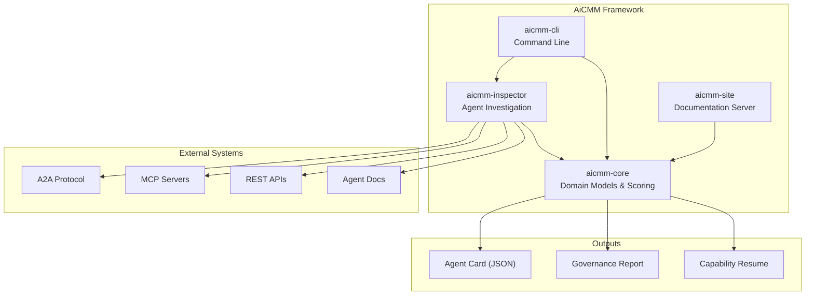
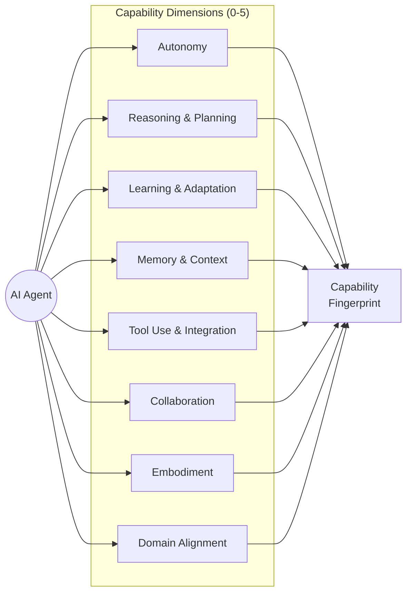
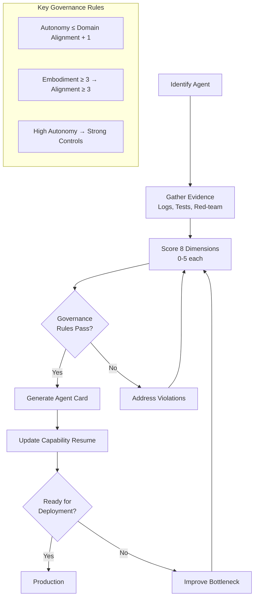
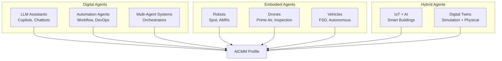
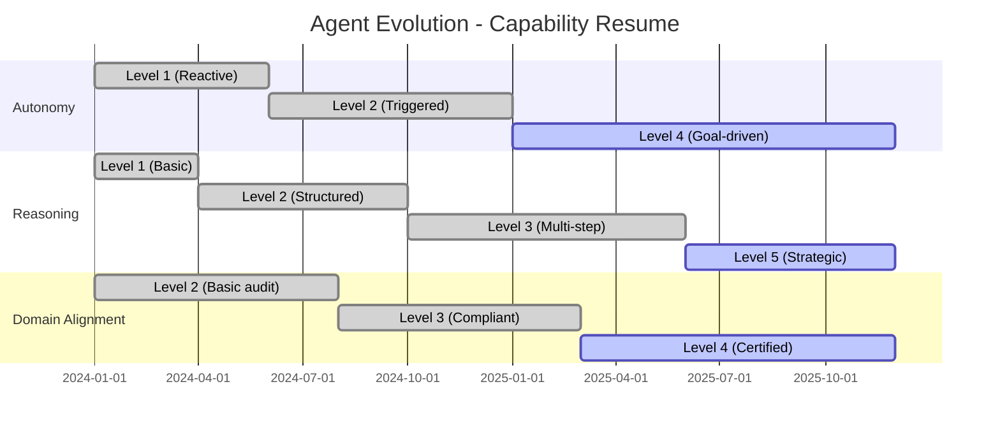

# AiCMM Framework Architecture

This document provides architectural diagrams for the Agent Capability Maturity Model framework.

## System Architecture

## Eight Dimensions Model

## Scoring & Governance Flow

## Agent Categories

## Capability Resume Timeline

