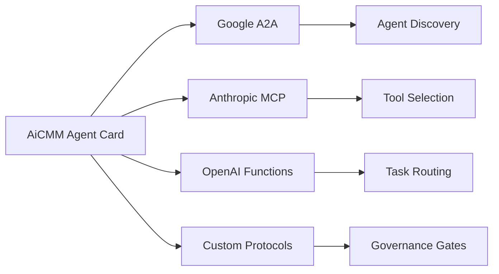
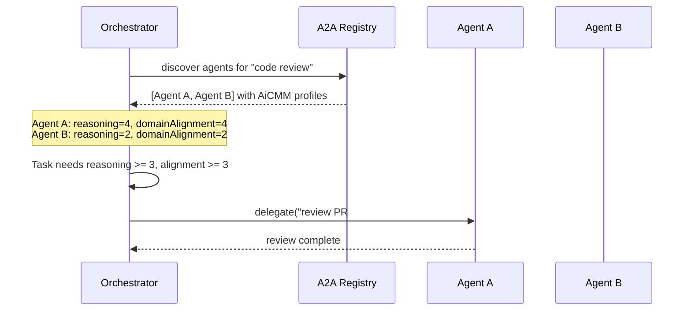
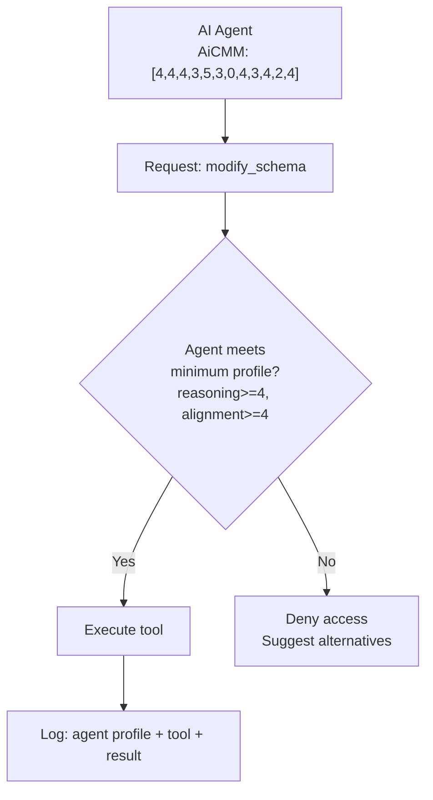

# Standards Integration Guide

How AiCMM Agent Cards integrate with major agent communication protocols.

---

## Overview

AiCMM Agent Cards are designed to be **embeddable capability metadata** that enriches any agent protocol with structured, comparable, governance-aware capability descriptions.



---

## Google A2A (Agent-to-Agent Protocol)

### What is A2A?

Google's A2A protocol enables agents to discover, communicate with, and delegate tasks to other agents. Each agent publishes an **Agent Card** at `/.well-known/agent.json` for discovery.

### How AiCMM Integrates

AiCMM capability profiles embed as an `extensions.aicmm` field in the A2A Agent Card:

```json
{
  "name": "GitHub Copilot CLI",
  "description": "Terminal-based coding assistant",
  "url": "https://copilot.github.com",
  "provider": {
    "organization": "GitHub",
    "url": "https://github.com"
  },
  "version": "1.0.40",
  "capabilities": {
    "streaming": true,
    "pushNotifications": true
  },
  "skills": [
    {
      "id": "code-generation",
      "name": "Code Generation",
      "description": "Generates code from natural language descriptions"
    },
    {
      "id": "debugging",
      "name": "Debugging",
      "description": "Identifies and fixes bugs in code"
    }
  ],
  "extensions": {
    "aicmm": {
      "schemaVersion": "0.2.0",
      "_dimensionSchema": "level0-v0.2",
      "capabilityProfile": {
        "autonomy": { "position": 0, "score": 4, "confidence": "high" },
        "reasoning": { "position": 1, "score": 4, "confidence": "high" },
        "memory": { "position": 2, "score": 4, "confidence": "medium" },
        "learning": { "position": 3, "score": 3, "confidence": "medium" },
        "toolUse": { "position": 4, "score": 5, "confidence": "high" },
        "collaboration": { "position": 5, "score": 3, "confidence": "medium" },
        "embodiment": { "position": 6, "score": 0, "confidence": "high" },
        "explainability": { "position": 7, "score": 4, "confidence": "medium" },
        "safety": { "position": 8, "score": 3, "confidence": "high" },
        "interoperability": { "position": 9, "score": 4, "confidence": "medium" },
        "costEfficiency": { "position": 10, "score": 2, "confidence": "medium" },
        "domainAlignment": { "position": 11, "score": 4, "confidence": "high" }
      },
      "governanceValidation": {
        "passed": true,
        "rulesChecked": 7,
        "violations": []
      },
      "totalScore": 40,
      "averageScore": 3.33,
      "category": "digital",
      "skillProfiles": {
        "code-generation": {
          "primaryDimensions": ["reasoning", "toolUse", "explainability"],
          "minimumScores": {"reasoning": 3, "toolUse": 4, "explainability": 3}
        },
        "debugging": {
          "primaryDimensions": ["reasoning", "memory", "toolUse"],
          "minimumScores": {"reasoning": 4, "memory": 3, "toolUse": 4}
        }
      }
    }
  }
}
```

### Benefits for A2A

| Benefit | Description |
|---------|-------------|
| **Informed Delegation** | An orchestrator can check if a target agent's AiCMM profile meets the task requirements before delegating |
| **Governance Routing** | Tasks requiring high domain alignment can be routed only to compliant agents |
| **Capability Matching** | Match task requirements to agent strengths using dimensional scores |
| **Risk Assessment** | Autonomy vs. Alignment gap reveals governance risk before delegation |

### A2A Task Routing with AiCMM



---

## Anthropic MCP (Model Context Protocol)

### What is MCP?

MCP enables AI models to connect to external tools, data sources, and services through a standardized protocol. Servers expose tools; clients (AI models) consume them.

### How AiCMM Integrates

AiCMM metadata annotates MCP server manifests to describe the capability requirements and governance posture:

```json
{
  "name": "database-mcp-server",
  "version": "2.1.0",
  "tools": [
    {
      "name": "query_database",
      "description": "Execute SQL queries",
      "inputSchema": { "type": "object", "properties": { "sql": { "type": "string" } } }
    },
    {
      "name": "modify_schema",
      "description": "ALTER database schema",
      "inputSchema": { "type": "object", "properties": { "ddl": { "type": "string" } } }
    }
  ],
  "metadata": {
    "aicmm": {
      "schemaVersion": "0.2.0",
      "_dimensionSchema": "level0-v0.2",
      "serverCapabilityProfile": {
        "autonomy": { "position": 0, "score": 2, "confidence": "medium" },
        "reasoning": { "position": 1, "score": 3, "confidence": "medium" },
        "memory": { "position": 2, "score": 3, "confidence": "medium" },
        "learning": { "position": 3, "score": 1, "confidence": "low" },
        "toolUse": { "position": 4, "score": 5, "confidence": "high" },
        "collaboration": { "position": 5, "score": 2, "confidence": "medium" },
        "embodiment": { "position": 6, "score": 0, "confidence": "high" },
        "explainability": { "position": 7, "score": 4, "confidence": "high" },
        "safety": { "position": 8, "score": 4, "confidence": "high" },
        "interoperability": { "position": 9, "score": 4, "confidence": "high" },
        "costEfficiency": { "position": 10, "score": 3, "confidence": "medium" },
        "domainAlignment": { "position": 11, "score": 4, "confidence": "high" }
      },
      "toolRequirements": {
        "query_database": {
          "minimumClientProfile": {
            "reasoning": 2,
            "domainAlignment": 3,
            "safety": 3
          },
          "riskLevel": "low"
        },
        "modify_schema": {
          "minimumClientProfile": {
            "reasoning": 4,
            "domainAlignment": 4,
            "explainability": 3,
            "safety": 4
          },
          "riskLevel": "high",
          "requiresApproval": true
        }
      }
    }
  }
}
```

### Benefits for MCP

| Benefit | Description |
|---------|-------------|
| **Tool Gating** | High-risk tools require minimum capability scores from the calling agent |
| **Audit Trail** | AiCMM profile of both server and client recorded for compliance |
| **Progressive Access** | As an agent matures, it unlocks higher-risk tool access |
| **Client Matching** | Servers can advertise which level of agent they're designed for |

### MCP Tool Selection with AiCMM



---

## OpenAI Function Calling

### How AiCMM Integrates

For OpenAI-compatible function calling, AiCMM metadata can be embedded in function definitions to guide routing and capability-aware selection:

```json
{
  "tools": [
    {
      "type": "function",
      "function": {
        "name": "deploy_to_production",
        "description": "Deploy application to production environment",
        "parameters": {
          "type": "object",
          "properties": {
            "service": { "type": "string" },
            "version": { "type": "string" }
          }
        },
        "metadata": {
          "aicmm": {
            "requiredProfile": {
              "autonomy": 4,
              "reasoning": 4,
              "domainAlignment": 5
            },
            "riskLevel": "critical",
            "governanceGate": "production-deployment"
          }
        }
      }
    }
  ]
}
```

---

## Custom Protocol Integration

For any protocol, AiCMM provides a standard JSON block that can be embedded:

### Minimal Embedding (Compact)

```json
{
  "aicmm": "0.2.0",
  "profile": [4, 4, 4, 3, 5, 3, 0, 4, 3, 4, 2, 4],
  "compliant": true
}
```

The array order is always: `[autonomy, reasoning, memory, learning, toolUse, collaboration, embodiment, explainability, safety, interoperability, costEfficiency, domainAlignment]`

### Full Embedding (Reference)

```json
{
  "aicmm": {
    "schemaVersion": "0.2.0",
    "_dimensionSchema": "level0-v0.2",
    "cardUrl": "https://agent.example.com/aicmm-card.json",
    "capabilityProfile": {
      "autonomy": { "position": 0, "score": 4, "confidence": "high" },
      "reasoning": { "position": 1, "score": 4, "confidence": "high" },
      "memory": { "position": 2, "score": 4, "confidence": "medium" },
      "learning": { "position": 3, "score": 3, "confidence": "medium" },
      "toolUse": { "position": 4, "score": 5, "confidence": "high" },
      "collaboration": { "position": 5, "score": 3, "confidence": "medium" },
      "embodiment": { "position": 6, "score": 0, "confidence": "high" },
      "explainability": { "position": 7, "score": 4, "confidence": "medium" },
      "safety": { "position": 8, "score": 3, "confidence": "high" },
      "interoperability": { "position": 9, "score": 4, "confidence": "medium" },
      "costEfficiency": { "position": 10, "score": 2, "confidence": "medium" },
      "domainAlignment": { "position": 11, "score": 4, "confidence": "high" }
    },
    "level1Profile": {
      "domain": "manufacturing",
      "dimensions": {
        "processReliability": 4,
        "operatorSafety": 4,
        "workflowIntegration": 5,
        "traceability": 4,
        "equipmentCoordination": 4,
        "qualityControl": 4,
        "downtimeResilience": 3,
        "humanOverride": 5
      }
    },
    "governanceValidation": {
      "passed": true,
      "rulesChecked": 7,
      "violations": []
    },
    "category": "digital",
    "assessedDate": "2026-05-24"
  }
}
```

---

## Governance Decision Matrix

How AiCMM scores inform routing and access decisions across all protocols:

| Scenario | Required Scores | Gate Type |
|----------|----------------|-----------|
| Read-only data access | toolUse >= 2 | Automatic |
| Write to non-prod | toolUse >= 3, alignment >= 3 | Automatic |
| Write to production | toolUse >= 4, alignment >= 4 | Human approval |
| Financial transactions | reasoning >= 4, alignment >= 5 | Multi-party approval |
| Autonomous agent creation | autonomy >= 4, alignment >= 5 | Governance board |
| Cross-agent delegation | collaboration >= 3, alignment >= 3 | Automatic with audit |
| Physical world actions | embodiment >= 3, alignment >= 4 | Safety review |

---

## Implementation Checklist

For protocol implementers who want to incorporate AiCMM:

1. **Add AiCMM extension field** to your agent/tool metadata schema
2. **Validate profiles** against `agent-card.schema.json` on ingestion
3. **Implement capability matching** — compare task requirements to agent profiles
4. **Add governance checks** — enforce the 7 Level 0 governance rules during routing and execution
5. **Log AiCMM metadata** in audit trails for compliance
6. **Expose profiles in discovery** — allow clients to filter agents by capability
7. **Support progressive access** — unlock features as agents mature

---

## Resources

- [AiCMM Agent Card JSON Schema](../schemas/agent-card.schema.json)
- [Agent Card Template](../templates/agent-card-template.md)
- [Full Framework Specification](../docs/articles/overview-medium.md)
- [Google A2A Protocol](https://github.com/google/A2A)
- [Anthropic MCP](https://modelcontextprotocol.io)
- [OpenAI Function Calling](https://platform.openai.com/docs/guides/function-calling)
