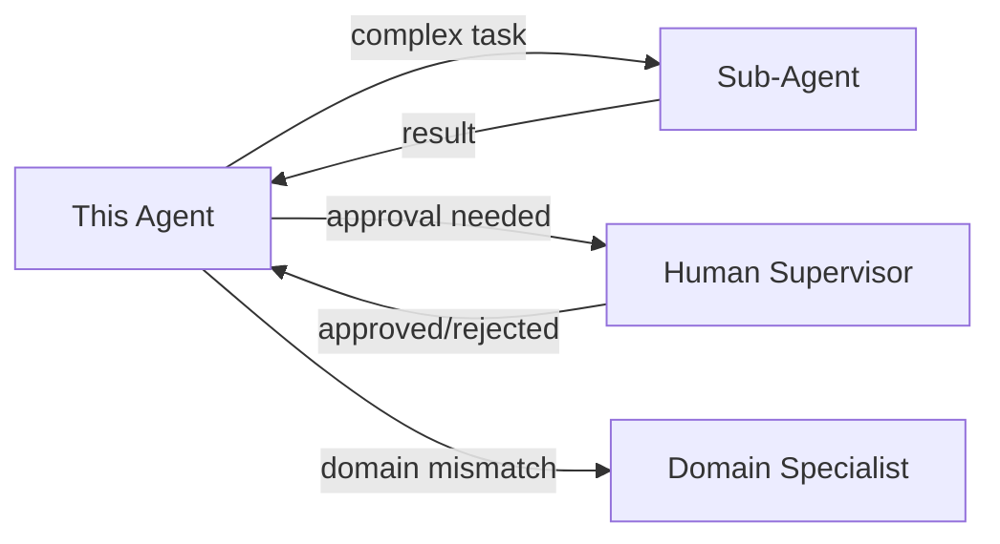

# Agent Card Template

> **a•CMM Agent Card v0.2.0** — A standardized capability description for AI agents.
>
> Copy this template, fill in all sections, and save as `<agent-name>-agent-card.json` (or `.yaml`/`.md`).

---

## Agent Identity

| Field | Value |
|-------|-------|
| **Name** | _[Agent name — e.g., "GitHub Copilot CLI"]_ |
| **Version** | _[Agent version being evaluated — e.g., "1.0.40"]_ |
| **Vendor** | _[Organization — e.g., "GitHub / Microsoft"]_ |
| **Category** | _[`digital` \| `embodied` \| `hybrid`]_ |
| **Description** | _[One-paragraph summary of the agent's purpose and capabilities]_ |
| **URL** | _[Link to agent documentation or homepage]_ |

---

## a•CMM Capability Scores

Score each dimension **0–5** with observable evidence.

| Pos | Group | Dimension | Score | Evidence |
|-----|-------|-----------|:-----:|----------|
| 0 | **Cognitive Core** | **Autonomy** | _/5_ | _[How independently does it act? What triggers require human input?]_ |
| 1 | **Cognitive Core** | **Reasoning & Planning** | _/5_ | _[Can it decompose problems? Multi-step planning? Handle uncertainty?]_ |
| 2 | **Cognitive Core** | **Memory & Context** | _/5_ | _[Working memory size? Long-term retrieval? Temporal awareness?]_ |
| 3 | **Cognitive Core** | **Learning & Adaptation** | _/5_ | _[Does it improve from experience safely? What feedback loops exist?]_ |
| 4 | **Action & Integration** | **Tool Use & Integration** | _/5_ | _[What tools can it use? How autonomously? Error recovery?]_ |
| 5 | **Action & Integration** | **Collaboration & Social Intelligence** | _/5_ | _[Multi-agent coordination? Empathy? Age-appropriate communication? Inclusivity?]_ |
| 6 | **Action & Integration** | **Embodiment** | _/5_ | _[Physical sensors? Navigation? Manipulation? (0 for pure software)]_ |
| 7 | **Trust & Deployment** | **Explainability & Transparency** | _/5_ | _[Can it explain decisions, cite evidence, and support human review?]_ |
| 8 | **Trust & Deployment** | **Safety & Containment** | _/5_ | _[What guardrails, fail-safes, and containment controls exist?]_ |
| 9 | **Trust & Deployment** | **Interoperability** | _/5_ | _[Can it work across protocols, agents, and ecosystems?]_ |
| 10 | **Trust & Deployment** | **Cost Efficiency** | _/5_ | _[Does it operate with bounded resource use and economic discipline?]_ |
| 11 | **Trust & Deployment** | **Domain Alignment** | _/5_ | _[Policy compliance? Audit trail? Domain-specific deployment fit?]_ |

**Capability Fingerprint**: `[_, _, _, _, _, _, _, _, _, _, _, _]`

**Total Score**: _/60_ | **Average**: _/5_ | **Governance Compliant**: _[Yes/No]_

---

## Skills

List the agent's core competencies — what it can do without external tools.

| Skill | Proficiency | Description |
|-------|:-----------:|-------------|
| _[e.g., Code Generation]_ | _[Beginner/Intermediate/Advanced/Expert]_ | _[Brief description]_ |
| _[e.g., Natural Language Understanding]_ | _[...]_ | _[...]_ |
| _[e.g., Mathematical Reasoning]_ | _[...]_ | _[...]_ |
| | | |

---

## Tools

External tools and APIs the agent can invoke.

| Tool | Access Method | Autonomy Level | Description |
|------|:------------:|:--------------:|-------------|
| _[e.g., Shell/Terminal]_ | _[direct/API/MCP]_ | _[supervised/autonomous]_ | _[What it uses it for]_ |
| _[e.g., Web Search]_ | _[...]_ | _[...]_ | _[...]_ |
| _[e.g., File System]_ | _[...]_ | _[...]_ | _[...]_ |
| | | | |

---

## Plugins / Extensions

Pluggable capabilities that extend the agent's base functionality.

| Plugin | Type | Status | Description |
|--------|------|:------:|-------------|
| _[e.g., Code Interpreter]_ | _[built-in/third-party]_ | _[active/available/disabled]_ | _[What it adds]_ |
| _[e.g., Image Generation]_ | _[...]_ | _[...]_ | _[...]_ |
| | | | |

---

## MCP Connections

Model Context Protocol servers this agent connects to.

| MCP Server | Endpoint | Tools Provided | Auth |
|------------|----------|----------------|:----:|
| _[e.g., GitHub MCP]_ | _[stdio/http URL]_ | _[list key tools]_ | _[token/none]_ |
| _[e.g., Filesystem MCP]_ | _[...]_ | _[...]_ | _[...]_ |
| | | | |

---

## Delegation Rules

How this agent delegates work and interacts with other agents.

| Rule | Description |
|------|-------------|
| **Can Delegate To** | _[List agents/systems this agent can delegate subtasks to]_ |
| **Accepts Delegation From** | _[Who can assign tasks to this agent?]_ |
| **Delegation Triggers** | _[When does it delegate? Complexity threshold? Domain mismatch?]_ |
| **Escalation Policy** | _[When does it escalate to a human? What are the guardrails?]_ |
| **Max Delegation Depth** | _[How many levels deep can delegation chain?]_ |
| **Feedback Loop** | _[Does it learn from delegated task outcomes?]_ |

### Delegation Flow



---

## Preferred Tasks

Tasks this agent is optimized for — use these to get the best results.

| Task Category | Examples | Confidence |
|---------------|----------|:----------:|
| _[e.g., Code Refactoring]_ | _[Rename variables, extract methods, reduce complexity]_ | _[High/Medium/Low]_ |
| _[e.g., Documentation]_ | _[API docs, README generation, inline comments]_ | _[...]_ |
| _[e.g., Debugging]_ | _[Stack trace analysis, root cause identification]_ | _[...]_ |
| | | |

---

## Limitations

Known boundaries, failure modes, and constraints.

| Category | Limitation | Impact | Mitigation |
|----------|-----------|:------:|------------|
| **Knowledge Cutoff** | _[e.g., Training data up to Oct 2024]_ | _[Medium]_ | _[Use web search for current info]_ |
| **Context Window** | _[e.g., 128K tokens max]_ | _[High for large codebases]_ | _[Chunking, summarization]_ |
| **Hallucination Risk** | _[e.g., May generate plausible but incorrect code]_ | _[High]_ | _[Always verify outputs]_ |
| **No Persistent Memory** | _[e.g., Forgets between sessions]_ | _[Medium]_ | _[External memory stores]_ |
| **Domain Gaps** | _[e.g., Limited medical/legal knowledge]_ | _[High in those domains]_ | _[Domain-specific fine-tuning]_ |
| | | | |

### Hard Boundaries (Will Not / Cannot)

- _[e.g., Cannot access the internet without explicit tool]_
- _[e.g., Will not generate harmful content]_
- _[e.g., Cannot execute code in production environments]_
- _[e.g., Maximum execution time: 10 minutes per task]_

---

## Self-Assessment Notes

> This section is for the **assessor** (human or automated) to record observations,
> confidence levels, and context about the evaluation.

### Assessment Metadata

| Field | Value |
|-------|-------|
| **Assessed By** | _[Name/system that performed this assessment]_ |
| **Assessment Date** | _[YYYY-MM-DD]_ |
| **Methodology** | _[manual-expert \| automated-inspection \| hybrid \| self-reported]_ |
| **Confidence Level** | _[High \| Medium \| Low]_ |
| **Evidence Sources** | _[List: docs, testing, red-teaming, production logs, etc.]_ |

### Scoring Rationale

Document why each dimension received its score — what evidence supports it and what's uncertain:

1. **Autonomy**: _[Why this score? What was observed?]_
2. **Reasoning & Planning**: _[...]_
3. **Memory & Context**: _[...]_
4. **Learning & Adaptation**: _[...]_
5. **Tool Use & Integration**: _[...]_
6. **Collaboration & Social Intelligence**: _[...]_
7. **Embodiment**: _[...]_
8. **Explainability & Transparency**: _[...]_
9. **Safety & Containment**: _[...]_
10. **Interoperability**: _[...]_
11. **Cost Efficiency**: _[...]_
12. **Domain Alignment**: _[...]_

### Governance Notes

- **Compliance Status**: _[Compliant / Non-compliant / Conditional]_
- **Violations (if any)**: _[List governance rule violations]_
- **Remediation Plan**: _[Steps to achieve compliance]_
- **Waivers**: _[Any approved governance waivers with justification]_

### Observation Notes

_[Free-form notes about the assessment process — surprises, edge cases discovered,
areas that need deeper investigation, disagreements between assessors, etc.]_

### Comparison Context

_[How does this agent compare to similar agents? Is it best-in-class for certain
dimensions? Are there capabilities that seem over/under-rated?]_

### Reassessment Triggers

The following events should trigger a reassessment of this Agent Card:

- [ ] Major version upgrade
- [ ] New tool integrations added
- [ ] Deployment domain changes
- [ ] Governance policy updates
- [ ] Incident or failure event
- [ ] 90 days since last assessment

---

## Machine-Readable Format (JSON)

<details>
<summary>Click to expand JSON Agent Card</summary>

```json
{
  "schemaVersion": "0.2.0",
  "_dimensionSchema": "level0-v0.2",
  "agent": {
    "name": "",
    "version": "",
    "vendor": "",
    "description": "",
    "category": "digital",
    "url": ""
  },
  "capabilityProfile": {
    "autonomy": { "position": 0, "score": 0, "confidence": "medium", "evidence": "" },
    "reasoning": { "position": 1, "score": 0, "confidence": "medium", "evidence": "" },
    "memory": { "position": 2, "score": 0, "confidence": "medium", "evidence": "" },
    "learning": { "position": 3, "score": 0, "confidence": "medium", "evidence": "" },
    "toolUse": { "position": 4, "score": 0, "confidence": "medium", "evidence": "" },
    "collaboration": { "position": 5, "score": 0, "confidence": "medium", "evidence": "" },
    "embodiment": { "position": 6, "score": 0, "confidence": "medium", "evidence": "" },
    "explainability": { "position": 7, "score": 0, "confidence": "medium", "evidence": "" },
    "safety": { "position": 8, "score": 0, "confidence": "medium", "evidence": "" },
    "interoperability": { "position": 9, "score": 0, "confidence": "medium", "evidence": "" },
    "costEfficiency": { "position": 10, "score": 0, "confidence": "medium", "evidence": "" },
    "domainAlignment": { "position": 11, "score": 0, "confidence": "medium", "evidence": "" }
  },
  "level1Profile": {
    "domain": "",
    "dimensions": {}
  },
  "governanceValidation": {
    "passed": true,
    "rulesChecked": 7,
    "violations": []
  },
  "skills": [],
  "tools": [],
  "plugins": [],
  "mcpConnections": [],
  "delegationRules": {
    "canDelegateTo": [],
    "acceptsDelegationFrom": [],
    "maxDelegationDepth": 1,
    "escalationPolicy": ""
  },
  "preferredTasks": [],
  "limitations": {
    "hardBoundaries": [],
    "knownWeaknesses": []
  },
  "operationalConstraints": {
    "domain": "",
    "safetyClass": "",
    "regulatoryFrameworks": []
  },
  "assessmentMetadata": {
    "assessedBy": "",
    "assessedDate": "",
    "methodology": "",
    "confidenceLevel": "",
    "evidenceSources": []
  },
  "selfAssessmentNotes": {
    "scoringRationale": {},
    "governanceNotes": "",
    "observations": "",
    "reassessmentTriggers": []
  }
}
```

</details>

---

## Usage Instructions

1. **Copy** this template to your project
2. **Fill in** all sections with evidence-based information
3. **Score** each dimension using the [a•CMM Scoring Rubric](../docs/articles/overview-medium.md)
4. **Validate** governance compliance against the 7 Level 0 rules
5. **Add** a Level 1 domain profile when the deployment context requires domain-specific scoring
6. **Submit** as a PR to the [AiCMM examples](../examples/) directory or embed in your agent's metadata

### Validation

```bash
# Validate your Agent Card against the schema
java -jar aicmm-cli/target/aicmm-cli.jar validate --card my-agent-card.json

# Generate a radar chart visualization
java -jar aicmm-site/target/aicmm-site-0.1.0-SNAPSHOT.jar --port 8090
# → View at http://localhost:8090/agent-cards
```

---

*Template version: 0.2.0 | Framework: a•CMM Agent Capability Maturity Model*
